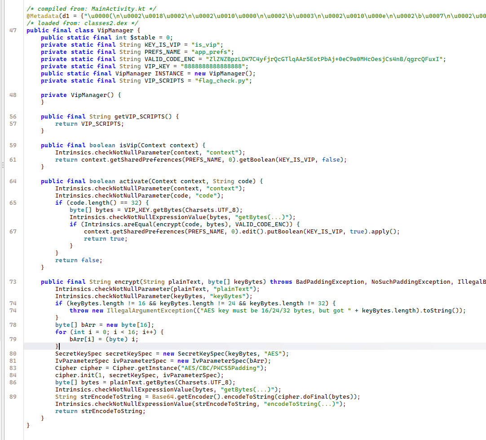
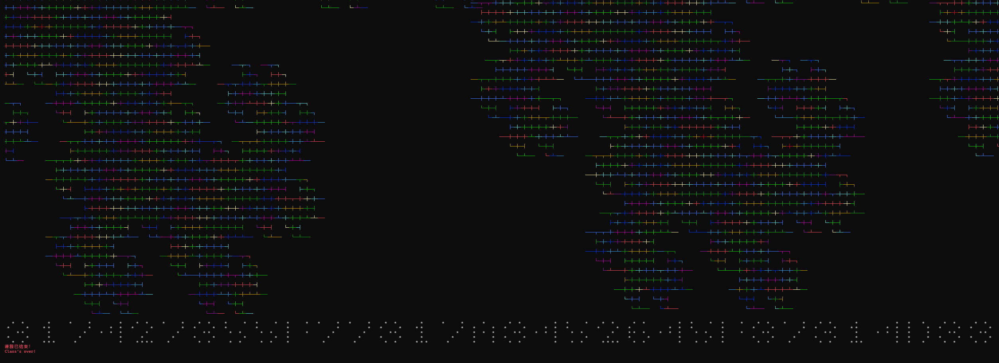

记录逆向学习进程！<br>
赛题质量很高，遇到了自己一直想做但是没做的项目，学到很多干货！

# Maybe Android
附件为在Android设备上运行Python的小工具，观察题目描述知道flag是使脚本`flag_check.py`正确返回的参数<br>
在jadx-gui中分析，得知UI是用Compose写的（~~Compose优雅捏~~）<br>
而只有尊贵的VIP用户可以运行这个脚本，遂查找相关逻辑：


~~随后修改isVip的返回值为true继续下一步~~<br>
注意到激活码使用AES加密与base64编码且值为32位<br>
其中`key`为`8888888888888888`，密文为`"ZlZNZBpzLDK7C4yfjrQcGTlqAAr5EotPbAj+0eC9w0MHcOesjCs4nB/qgrcQFuxI"`,IV为0-15递增的数组<br>
遂编写脚本解密：
```python
import base64
from Crypto.Cipher import AES
from Crypto.Util.Padding import unpad

encrypted_base64 = "ZlZNZBpzLDK7C4yfjrQcGTlqAAr5EotPbAj+0eC9w0MHcOesjCs4nB/qgrcQFuxI"
key = b"8888888888888888"
iv = bytes([i for i in range(16)])

try:
    ciphertext = base64.b64decode(encrypted_base64)
    cipher = AES.new(key, AES.MODE_CBC, iv)
    decrypted_bytes = unpad(cipher.decrypt(ciphertext), AES.block_size)
    activation_code = decrypted_bytes.decode('utf-8')
    print(f"{activation_code}")

except Exception as e:
    print(f"exception: {e}")
```
得到激活码为`F4E52DFB41CCC32F8FFFC340A3804383`<br>
随后注意到`flag_check.py`脚本包含对文件`"😇"`的读取<br>
翻assets没有找到`"😇"`，疑似是对python运行环境动了手脚<br>
在`VipDecryptor`类中看到相关逻辑：
```java
package com.example.maybeandroid;

import android.content.Context;
import java.io.File;
import kotlin.Metadata;
import kotlin.io.FilesKt;
import kotlin.jvm.internal.Intrinsics;

public final class VipDecryptor {
    public static final int $stable = 8;
    private final Context context;

    private final native byte[] getDecryptedScript();

    public VipDecryptor(Context context) {
        Intrinsics.checkNotNullParameter(context, "context");
        this.context = context;
        System.loadLibrary("vipdecryptor");
    }

    public final void saveDecryptedScript() {
        byte[] decryptedScript = getDecryptedScript();
        File file = new File(this.context.getFilesDir(), "python/lib/python3.14/site-packages");
        if (!file.exists()) {
            file.mkdirs();
        }
        FilesKt.writeBytes(new File(file, "sitecustomize.py"), decryptedScript);
    }
}
```
给个参数运行一次，然后查找data目录，得到`sitecustomize.py`如下：
```python
import builtins

class Origin:
    def init(self):
        self.open = builtins.open

origin = Origin()

class CustomSum:
    def init(self):
        self.sum = 0

    def lshift(self, other):
        if other == "😢":
            self.sum += 1
            return self
        
    def eq(self, value):
        if value == "😃":
            return self.sum
        return False

class Keyget:
    def init(self):
        self.key = "y0u_@re_vip_Us3r"
        self.index = 0

    def lshift(self, other):
        if other == "😢":
            val = ord(self.key[self.index % len(self.key)])
            self.index += 1
            return val

class GetEnc:
    def init(self):
        self.enc_data = bytes.fromhex("738d9ea5a7c5824836d63c872324e36936c1dd7026b2df418268066a936256a7")
        self.index = 0
    def lshift(self, other):
        if other == "😢":
            val = self.enc_data[self.index % len(self.enc_data)]
            self.index += 1
            return val ^ 0x55

class oprate:
    def init(self,file,mode,*args,**kwargs):
        if file == "😇" and mode == "r":
            return
        try :
            origin.open(file = file, mode = mode, *args, **kwargs)
        except Exception as e:
            print(e)
  
    def xor(self, other):
        if other == "😋":
            return CustomSum()
        elif other == "🫨":
            return list(range(256))
        elif other == "😁":
            return Keyget()
        elif other == "😤":
            return GetEnc()
        return self

builtins.open = oprate

```
观察这个很复杂很复杂的代理逻辑，以及脚本：
```python
import sys
len(sys.argv) != 2 and (print("error arguments provided, exiting.") or exit(0))
f = sys.argv[1]
a = open("😇","r")
b = a ^ "😋"
for i in f: b << "😢"
if not (b == "😃") == (((a ^ "😋") << '😢' << '😢' << '😢' << '😢' << '😢' << '😢' << '😢' << '😢' << '😢' << '😢' << '😢' << '😢' << '😢' << '😢' << '😢' << '😢' << '😢' << '😢' << '😢' << '😢' << '😢' << '😢' << '😢' << '😢' << '😢' << '😢' << '😢' << '😢' << '😢' << '😢' << '😢' << '😢') == "😃"):print("Length error");exit(0)
s = a ^ "🫨"
j = (((a ^ "😋")) == "😃")
c = (((a ^ "😋") << "😢" << "😢" << "😢" << "😢" << "😢" << "😢" << "😢" << "😢" << "😢" << "😢" << "😢" << "😢" << "😢" << "😢" << "😢" << "😢" << "😢" << "😢" << "😢" << "😢" << "😢" << "😢" << "😢" << "😢" << "😢" << "😢" << "😢" << "😢" << "😢" << "😢" << "😢" << "😢" << "😢" << "😢" << "😢" << "😢" << "😢" << "😢" << "😢" << "😢" << "😢" << "😢" << "😢" << "😢" << "😢" << "😢" << "😢" << "😢" << "😢" << "😢" << "😢" << "😢" << "😢" << "😢" << "😢" << "😢" << "😢" << "😢" << "😢" << "😢" << "😢" << "😢" << "😢" << "😢" << "😢" << "😢" << "😢" << "😢" << "😢" << "😢" << "😢" << "😢" << "😢" << "😢" << "😢" << "😢" << "😢" << "😢" << "😢" << "😢" << "😢" << "😢" << "😢" << "😢" << "😢" << "😢" << "😢" << "😢" << "😢" << "😢" << "😢" << "😢" << "😢" << "😢" << "😢" << "😢" << "😢" << "😢" << "😢" << "😢" << "😢" << "😢" << "😢" << "😢" << "😢" << "😢" << "😢" << "😢" << "😢" << "😢" << "😢" << "😢" << "😢" << "😢" << "😢" << "😢" << "😢" << "😢" << "😢" << "😢" << "😢" << "😢" << "😢" << "😢" << "😢" << "😢" << "😢" << "😢" << "😢" << "😢" << "😢" << "😢" << "😢" << "😢" << "😢" << "😢" << "😢" << "😢" << "😢" << "😢" << "😢" << "😢" << "😢" << "😢" << "😢" << "😢" << "😢" << "😢" << "😢" << "😢" << "😢" << "😢" << "😢" << "😢" << "😢" << "😢" << "😢" << "😢" << "😢" << "😢" << "😢" << "😢" << "😢" << "😢" << "😢" << "😢" << "😢" << "😢" << "😢" << "😢" << "😢" << "😢" << "😢" << "😢" << "😢" << "😢" << "😢" << "😢" << "😢" << "😢" << "😢" << "😢" << "😢" << "😢" << "😢" << "😢" << "😢" << "😢" << "😢" << "😢" << "😢" << "😢" << "😢" << "😢" << "😢" << "😢" << "😢" << "😢" << "😢" << "😢" << "😢" << "😢" << "😢" << "😢" << "😢" << "😢" << "😢" << "😢" << "😢" << "😢" << "😢" << "😢" << "😢" << "😢" << "😢" << "😢" << "😢" << "😢" << "😢" << "😢" << "😢" << "😢" << "😢" << "😢" << "😢" << "😢" << "😢" << "😢" << "😢" << "😢" << "😢" << "😢" << "😢" << "😢" << "😢" << "😢" << "😢" << "😢" << "😢" << "😢" << "😢" << "😢" << "😢" << "😢" << "😢" << "😢" << "😢" << "😢" << "😢" << "😢" << "😢" << "😢" << "😢" << "😢" << "😢" << "😢") == "😃")
d = a ^ "😁"
for i in range(c): j = (j + s[i] + (d << "😢")) % c; s[i], s[j] = s[j], s[i]
r = []
i,j = (((a ^ "😋")) == "😃"),(((a ^ "😋")) == "😃")
e = a ^ "😤"
for _ in f: i = (i + 1) % c; j = (j + s[i]) % c; s[i], s[j] = s[j], s[i]; g = s[(s[i] + s[j]) % c]; v = ord(_) ^ g; r.append(v);v != (e << "😢") and (print("Wrong ):") or exit(0))
print("Success!")
print("Flag is flag{<your_input>}")
```
解密脚本如下：
```python
def rc4_keystream(key: bytes, length: int) -> bytes:
    # KSA
    S = list(range(256))
    j = 0
    for i in range(256):
        j = (j + S[i] + key[i % len(key)]) % 256
        S[i], S[j] = S[j], S[i]

    # PRGA
    i = 0
    j = 0
    stream = []
    for _ in range(length):
        i = (i + 1) % 256
        j = (j + S[i]) % 256
        S[i], S[j] = S[j], S[i]
        K = S[(S[i] + S[j]) % 256]
        stream.append(K)

    return bytes(stream)


def main():
    key = b"y0u_@re_vip_Us3r"
    enc_hex = (
        "738d9ea5a7c5824836d63c872324e369"
        "36c1dd7026b2df418268066a936256a7"
    )
    enc_data = bytes.fromhex(enc_hex)

    ks = rc4_keystream(key, len(enc_data))

    flag_bytes = bytes(
        ks[i] ^ enc_data[i] ^ 0x55
        for i in range(len(enc_data))
    )

    flag = flag_bytes.decode("utf-8")
    print("flag{" + flag + "}")


if __name__ == "__main__":
    main()
```
得到flag为`flag{5f19b83de29bd46e9e02f7f88bfb4ea2}`

# Wizard Time

## 关于位图
:::note
*位图（Bitmap）是一种紧凑的数据表示方法，它使用 二进制位（bit）来高效地存储某种状态、标志或信息。位图的特点是用每一位二进制数据（0 或 1）表示某种属性的存在或不存在，因此对于某类数据的表示非常紧凑和高效。*
:::

通过字串定位到入口方法，找到检验输入合法性的方法如下：<br>

```c
__int64 __fastcall check(char *answer, int *lengthPtr)
{
  int v2; // ecx
  int v3; // ecx
  int v4; // ecx
  _QWORD desk[131]; // [rsp+20h] [rbp-60h] BYREF
  unsigned int v7; // [rsp+43Ch] [rbp+3BCh]
  char v8; // [rsp+443h] [rbp+3C3h]
  int length; // [rsp+444h] [rbp+3C4h]
  int n; // [rsp+448h] [rbp+3C8h]
  int m; // [rsp+44Ch] [rbp+3CCh]
  unsigned int sum; // [rsp+450h] [rbp+3D0h]
  int k; // [rsp+454h] [rbp+3D4h]
  int j; // [rsp+458h] [rbp+3D8h]
  int i; // [rsp+45Ch] [rbp+3DCh]

  Il111l11();
  for ( i = 0; i <= 4; ++i )
  {
    if ( (unsigned __int8)checkChar(&answer[65 * i]) != 1 )
    {
      IlIlIi1II(byte_14000C530);
      exit(v2);
    }
  }
  memset(desk, 0, 0x410uLL);
  for ( j = 0; j <= 4; ++j )
  {
    length = lengthPtr[j];
    if ( length > 63 )
    {
      IlIlIi1II(byte_14000C560);
      exit(v3);
    }
    for ( k = 0; k < length; ++k )
    {
      v8 = answer[65 * j + k];                  // answer[j][k]
      v7 = v8 - 97;
      if ( v7 >= 0x1A )
      {
        IlIlIi1II(byte_14000C590);
        exit(v4);
      }
      1ii[64 * (__int64)j + k] = v7 + 1;
      desk[26 * j + (int)v7] += 1LL << k;
    }
  }
  sum = 0;
  for ( m = 0; m <= 4; ++m )
  {
    for ( n = 0; n <= 25; ++n )
    {
      if ( desk[26 * m + n] == I1iiIi[26 * m + n] )
        ++sum;
    }
  }
  return sum;
}
```
要求`check()`返回`130`从位图还原答案后得到：
> line1: ccjhglfcfgfcfgdgdgdgdgfcjhghjcndgfchcndgdgfcfgfcjpdehchc
> line2: agfaphcdgldgdlltldgfapdgdghcdlgdpcdllgldgfalcdgdgdg
> line3: eajnfccjljahchcfgjljajnfcchafccfclfacfccfcfghaljajhccdghaja
> line4: aghlphlhglldplhghlhgdgllhhglldlghhghpdgdgdg
> line5: cchaahrfaaaflchchcfnllchaahjgfcnfchaaafcnfcfnchlchaandehchc

解密脚本如下：
```python
ALPHABET = "abcdefghijklmnopqrstuvwxyz"

I1iiIi = [
    # 第1组 (line 1): 26个QWORD
    0, 0, 0x0A0881420800883, 0x4014080154000, 0x8000000000000,
    0x540200401540, 0x2281042AA210, 0x5000080A000008, 0, 0x1000011000004,
    0, 0x20, 0, 0x2040000000, 0, 0x2000000000000,
    0, 0, 0, 0, 0, 0, 0, 0, 0, 0,

    # 第2组 (line 2): 26个QWORD
    0x40000100009, 0, 0x100208000040, 0x2A08491421480, 0, 0x20000080004,
    0x5412042840902, 0x4000020, 0, 0, 0,
    0x85820016200, 0, 0, 0,
    0x100200010, 0, 0, 0,
    0x8000, 0, 0, 0, 0, 0, 0,

    # 第3组 (line 3): 26个QWORD
    0x501200808100402, 0, 0x1802D163005060, 0x20000000000000, 0x1, 0x52490808010,
    0x40080000010000, 0x84100004002800, 0, 0x2028000002A0284,
    0, 0x400200040100, 0, 0x400008,
    0, 0, 0, 0, 0, 0, 0, 0, 0, 0, 0, 0,

    # 第4组 (line 4): 26个QWORD
    0x1, 0, 0,
    0x2A020100800, 0, 0,
    0x54484288102, 0x0B030540A4, 0, 0, 0,
    0x58C22648, 0, 0, 0,
    0x1000001010, 0, 0, 0, 0, 0, 0, 0, 0, 0, 0,

    # 第5组 (line 5): 26个QWORD
    0x0C003803000718, 0, 0x50124824042A003, 0x20000000000000, 0x40000000000000,
    0x0A4120040880, 0x10000000, 0x282400404814024, 0, 0x8000000,
    0, 0x800000301000, 0, 0x10110080080000, 0, 0, 0,
    0x40, 0, 0, 0, 0, 0, 0, 0, 0,
]

def bits_positions(x: int):
    pos = []
    i = 0
    while x:
        if x & 1:
            pos.append(i)
        x >>= 1
        i += 1
    return pos

def decode_line(bitmap_26):
    pos_to_char = {}
    max_pos = -1

    for letter_idx, bitmap in enumerate(bitmap_26):
        if bitmap == 0:
            continue
        ch = ALPHABET[letter_idx]
        for p in bits_positions(bitmap):
            pos_to_char[p] = ch
            if p > max_pos:
                max_pos = p

    if max_pos < 0:
        return ""
    return "".join(pos_to_char[p] for p in range(max_pos + 1))

def main():
    for i in range(5):
        bitmap_26 = I1iiIi[i*26 : (i+1)*26]
        s = decode_line(bitmap_26)
        print(s)

if __name__ == "__main__":
    main()
```

运行读出答案：`317427355F77317A3452645F37314D33`

转换到ASCII为：`1t'5_w1z4Rd_71M3`
