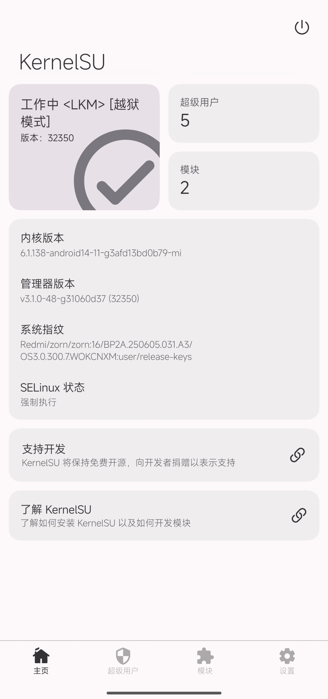

# 0x00 前言

> 2026/3/8 小米越狱漏洞流出<br>
本文章根据酷安 [@上善若水QwQ](https://www.coolapk.com/u/8325951) 文章整理而来
<br>理论适用于近几年推出的搭载高通芯片的小米全系机型<br>

# 0x01 原理分析
利用fastboot cmdline漏洞修改启动参数，使得SELinux为宽容模式  
接着利用 **小米质量服务（miui.mqsas.IMQSNative）** 漏洞，以root权限运行ksud，使用KeunelSU的late-load模式  
接着软重启，注入Zygisk，完成xposed模块加载

# 0x02 操作流程
## 先决条件
本人在Redmi K80 OS 3.0.300.7Beta 系统成功越狱（Android 安全更新：2026-02-01），不保证对新版系统依旧有效

## 准备工作
- 前往下载[SDK Platform Tools](https://developer.android.google.cn/tools/releases/platform-tools)并解压
- 获取KernelSU的CI版本，见[KernelSU群组](https://t.me/KernelSU_group/3234/466659)
- 获取Lsposed IT，见[Lsposed Internal Test群组](https://t.me/LSPosed/287)
- 获取[Zygisk Next](https://t.me/KernelSU_group/26909/448482)
- 获取ksud：zip打开kernelsu.apk，提取libs/arm64-v8a/libksud.so到fastboot.exe同目录下并重命名为ksud
- 开启USB调试

:::caution
尽管此方案并不会清除数据，但仍然建议开始操作前进行备份，以免误操作带来意外
:::

## 以SELinux宽容模式启动
在adb.exe同目录下打开Powershell，执行以下命令：
```bash
./adb.exe reboot bootloader
```

:::warning
请注意区分fastboot和fastbootd，本命令仅在fastboot模式下可用
:::

重启后，继续执行：
```bash
./fastboot.exe oem set-gpu-preemption 0 androidboot.selinux=permissive
```

如果此命令并未输出OKAY，则设备不支持越狱，不必往下做了

接着运行进入系统：
```bash
./fastboot.exe continue
```

## 加载KernelSU并安装模块

开机解锁屏幕进入桌面后，adb运行以下命令：
```bash
./adb.exe push ./ksud /data/local/tmp/
./adb.exe shell chmod 777 /data/local/tmp/ksud
./adb.exe shell service call miui.mqsas.IMQSNative 21 i32 1 s16 "/data/local/tmp/ksud" i32 1 s16 'late-load' s16 '/sdcard/ksulog.txt' i32 60
```
然后安装kernelsu.apk，打开管理器
当看到已激活\[越狱模式\]则成功加载


前往模块页面，找到并安装Zygisk Next和lsposed IT两个模块，并重启手机
重启完成后，请跳转到[以SELinux宽容模式启动](#以selinux宽容模式启动)步骤再次操作，以加载模块

## 软重启并修复LSPosed和Zygisk
下载[fix_lspd.sh脚本](https://raw.githubusercontent.com/xunchahaha/mi_nobl_root/main/fix_lspd.sh)并保存到手机<br>
使用KernelSU授予root权限并使用mt管理器以root权限运行脚本<br>
此时应该会软重启一次<br>
软重启完成后就可以使用xposed模块了！

:::important
对于LSPosed模块，当作用域为系统框架时会出现异常，请暂时不要使用这类模块
:::

## 关闭SELinux宽容模式

执行以下命令：
```bash
adb shell su -c setenforce 1
```

```bash 
adb shell su -c "resetprop ro.boot.selinux enforcing"
```

## 注意事项
:::caution
请不要使用临时root修改data外的任何分区！修改分区会导致[AVB](https://source.android.google.cn/docs/security/features/verifiedboot/avb)不通过带来手机拒绝启动<br>
此时只能前往小米之家寻求售后帮助
:::

:::tip
越狱（获取临时root加载KernelSU）会在重启后失效，若重启需要再次进行越狱操作
:::

:::note
据笔者测试，KernelSU的开机自动越狱（基于Magica）功能无法正常工作，请自行测试自己的机器是否支持
:::

