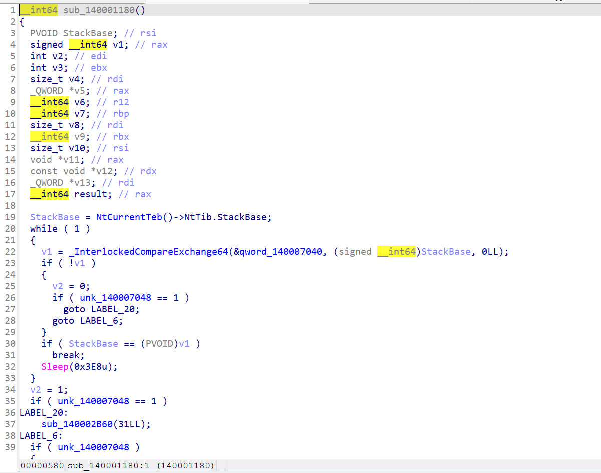
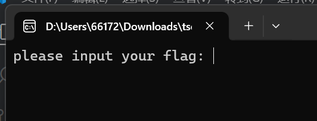
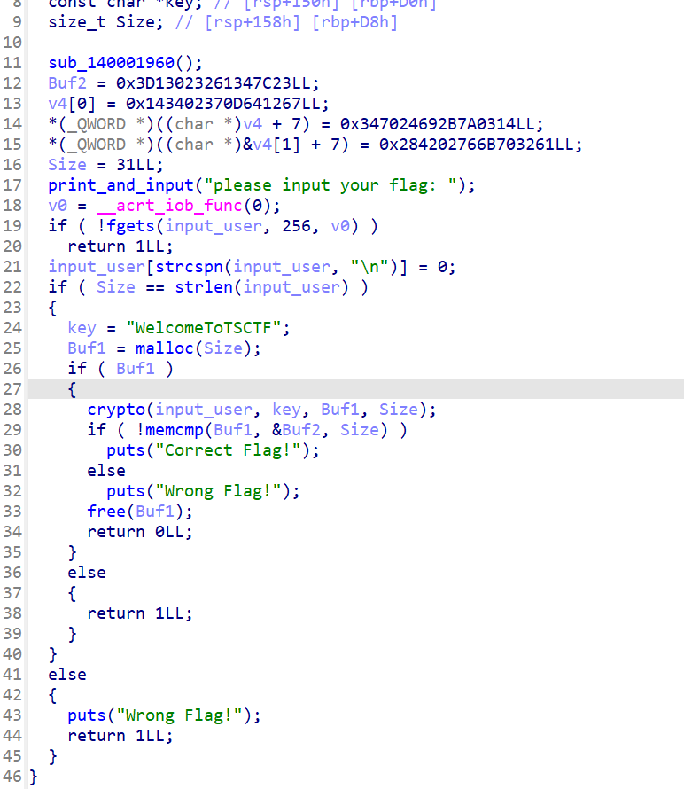
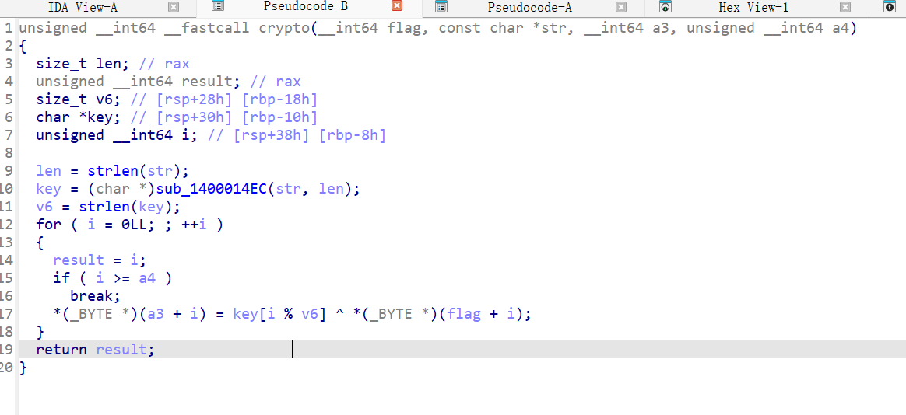
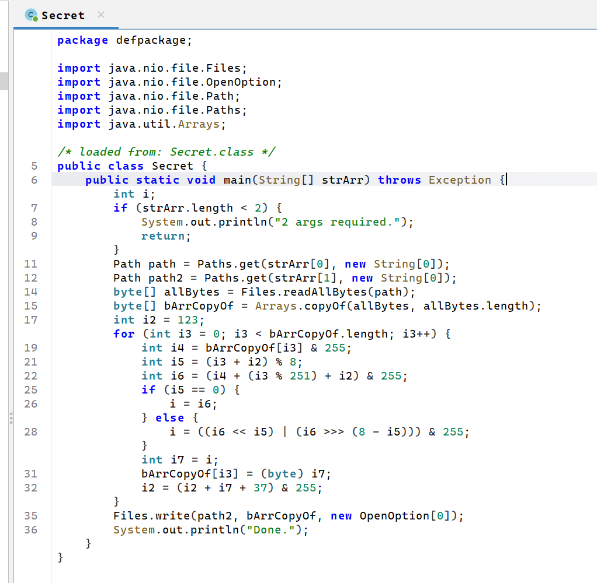
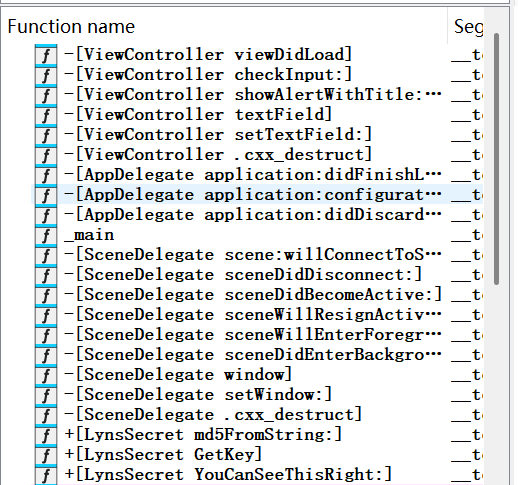
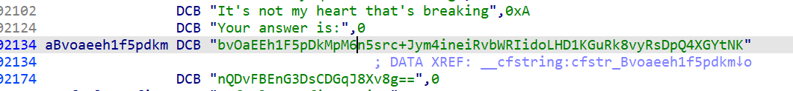
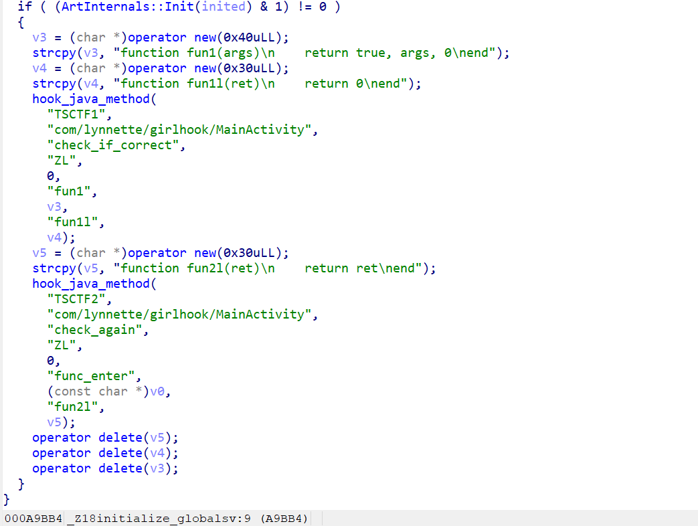
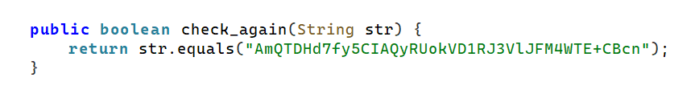
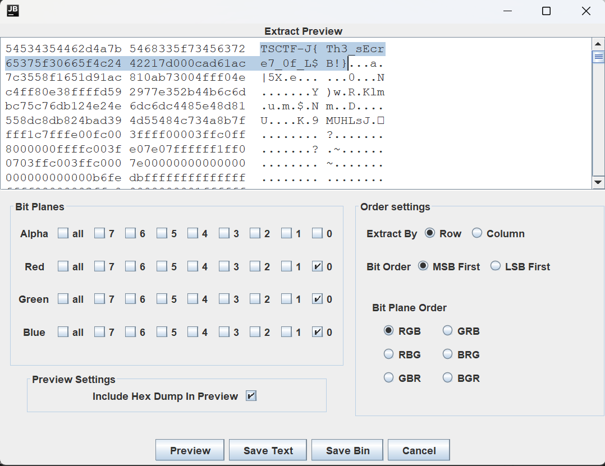

> Cover image source: [Source](https://www.pixiv.net/artworks/109301396)

## Reverse

### Singin

首先拖到IDA分析，发现入口函数 `start`中调用的函数只是错误处理相关逻辑

遂运行程序，看到相关字串

交叉引用后分析，推测相关逻辑：

从`Size`可知flag长度应是31
继续看crypto(`sub_7FF6DC0E1660`)
稍作分析可以看到是异或加密，其中`key`是对`"WelcomeToTSCTF"`进行一些处理，如图

继续查看`sub_1400014EC`得到一个类似Base64的东西，但是Base64表被处理
动态调试，知Base表应是`VkbKJo3PNcCSZQGXdUaLEwOet07jxAWmlsDqp9uf1Riy5F2nIB6rh4/+g8TzMYHv`
（此处省略截图）
完整脚本如下：

```cpp
#include <cstdio>
#include <cstring>
#include <iostream>
#include "reverse_signin.h"
#include <cstdint>

unsigned char *__fastcall base64_encode(uint64_t addr, uint64_t size);

int re_signin() {
    char Buf2[33] =
            "\x23\x7C\x34\x61\x32\x02\x13\x3D\x67\x12\x64\x0D\x37\x02\x34\x14\x03\x7A\x2B\x69\x24\x70\x34\x61\x32\x70\x6B\x76\x02\x42\x28";
    char secret[33];
    secret[32] = '\0';
    const char* prev = "WelcomeToTSCTF";
    unsigned char * base64ed = base64_encode((uint64_t)prev,14); //len = 20
    printf("%s\n", base64ed);
    for (int i = 0; i < 32; i++) {
        secret[i] = Buf2[i] ^ base64ed[i % 20];
        //printf("%lld\n",secret[i] & 0xff);
    }
    std::cout << secret << std::endl;
    return 0;
}

static const char base64_table[] =
    "VkbKJo3PNcCSZQGXdUaLEwOet07jxAWmlsDqp9uf1Riy5F2nIB6rh4/+g8TzMYHv";

unsigned char *__fastcall base64_encode(uint64_t addr, uint64_t size)
{
    uint64_t v3, v4, v5;
    unsigned char *v6;
    uint64_t i;
    uint64_t v8;
    int v9;
    int v10;

    v6 = (unsigned char *)malloc(4 * ((size + 2) / 3) + 1);
    if (!v6)
        return NULL;

    v10 = 0;
    v9 = -6;
    v8 = 0;

    for (i = 0; i < size; ++i)
    {
        v10 = (v10 << 8) + *((unsigned char *)addr + i);
        v9 += 8;
        while (v9 >= 0)
        {
            v3 = v8++;
            v6[v3] = base64_table[(v10 >> v9) & 0x3F];
            v9 -= 6;
        }
    }

    if (v9 >= -5) // 处理剩余比特
    {
        v4 = v8++;
        v6[v4] = base64_table[(v10 << 8 >> (v9 + 8)) & 0x3F];
    }

    while (v8 < 4 * ((size + 2) / 3))
    {
        v5 = v8++;
        v6[v5] = '=';
    }

    v6[v8] = 0;
    return v6;
}
```

运行可得flag为`TSCTF-J{We1c@me_t0_TS_CTF_2025}`

### 听绿的秘密

首先查看`hint.txt`知，运行`Tinglv.jar`，并且把Cat.png作为参数传入，可以得到`Where_is_my_cat.png`
打开jadx-gui，发现这个jar解密并动态加载了一个Class
这里反过来，从Secret解密 Secret.class的脚本如下：（对于每个字节减7）

```python
def decrypt_secret_obf(obf_file_path, decrypted_file_path):
    try:
        with open(obf_file_path, 'rb') as f_obf:
            obf_bytes = f_obf.read()

        decrypted_bytes = bytearray()
        for b in obf_bytes:
            decrypted_bytes.append((b - 7) & 0xFF)

        with open(decrypted_file_path, 'wb') as f_decrypted:
            f_decrypted.write(decrypted_bytes)

        print(f"'{obf_file_path}' decrypted to '{decrypted_file_path}' successfully.")
    except FileNotFoundError:
        print(f"Error: File not found at '{obf_file_path}'")
    except Exception as e:
        print(f"An error occurred: {e}")

if __name__ == "__main__":
    obf_file = "Secret.obf"
    decrypted_file = "Secret.class"

    decrypt_secret_obf(obf_file, decrypted_file)
```

继续查看`Secret.class`，有对Cat.png的加密逻辑

解密脚本如下：

```python
def decrypt():
    with open("Where_is_my_cat.png", "rb") as f:
        enc = bytearray(f.read())
    dec = bytearray(len(enc))
    i2 = 123
    for i3 in range(len(enc)):
        e = enc[i3] & 0xFF
        i5 = (i3 + i2) % 8
        i6 = ((e >> i5) | (e << (8 - i5))) & 0xFF
        dec[i3] = (i6 - (i3 % 251) - i2) & 0xFF
        i2 = (i2 + e + 37) & 0xFF
    with open("Decrypted_Cat.png", "wb") as f:
        f.write(dec)

if __name__ == "__main__":
    decrypt()
```

从`Decrypted_Cat.png`中读到flag为`TSCTF-J{181_c3ntimeTer5?}`
（小声）（所以听绿的秘密是什么？

### CryDancing

> I'm crying dancing<br>
> It's really quite outstanding<br>
> It's not my heart that's breaking<br>
> It's just the songs they're playing<br>

解压后找到`CryDancing`这个二进制文件，IDA打开
查看函数列表，查资料得，形如`+/-[abc]`为ObjectiveC的函数

推测flag相关逻辑位于LynsSecret中
发现`GetKey`函数进行穷举得一个四位字符串的md5为固定的值`674040176a34f6c994003fe85badfc48`
脚本如下：

```python
import hashlib
import itertools

target = "674040176a34f6c994003fe85badfc48"
charset = [chr(ord('A') + i) for i in range(26)]  # A..Z

for a,b,c,d in itertools.product(charset, repeat=4):
    s = a + b + c + d
    if hashlib.md5(s.encode()).hexdigest() == target:
        print("found:", s)
        break
```

发现`NOTD`满足，且`NOTD`参与歌曲`CryDancing`
继续查看`YouCanSeeThisRight:`函数，发现进行了某种`AES`解密，其中key是`NOTD`放置4次，需要Base64密文
回到IDA，从字串列表可得Base64密文如图：

解密脚本如下：

```python
from Crypto.Cipher import AES
from Crypto.Util.Padding import unpad
import base64

B64 = "bvOaEEh1F5pDkMpM6n5src+Jym4ineiRvbWRIidoLHD1KGuRk8vyRsDpQ4XGYtNKnQDvFBEnG3DsCDGqJ8Xv8g=="
KEY = (b"NOTD" * 4)  # 16 bytes
IV = (375).to_bytes(4, 'little') + b'\x00'*12  # first 4 bytes = 375 little-endian, rest zeros

ct = base64.b64decode(B64)
cipher = AES.new(KEY, AES.MODE_CBC, IV)
pt = unpad(cipher.decrypt(ct), AES.block_size)
print(pt.decode('utf-8', errors='replace'))
```

得到flag为`TSCTF-J{S0rry_th3_4nswer_h4s_n0thing_2_do_with_l7rics}`
（Cry Dancing好听捏

### GirlHook

jadx-gui从Java层看，只是简单的异或加密
得到flag为`TSCTF-J{how_to_hook_in_ART?}`
发现不正确，还加载了一个so进行hook
阅读题干`题如其名`找到[Lynnette177/GirlHook](https://github.com/Lynnette177/GirlHook)项目的地址
拖到IDA进行分析，找到hook相关方法`sub_A9B90`对应源码中的`initialize_globals`
看到需要找出`func_enter`的Lua函数，如图：

从`what_is_this`函数中看到Lua代码加密算法为ChaCha20
复制数据段的密文到二进制文件secret后，使用下面脚本解密：

```python
from Crypto.Cipher import ChaCha20
key = b'youareclosetoit_youareclosetoit_'
nonce = b'continueabcd'
counter = 1
with open('secret', 'rb') as f: 
    ciphertext = f.read()
cipher = ChaCha20.new(key=key, nonce=nonce)
cipher.seek(counter * 64)
plaintext = cipher.decrypt(ciphertext)
print(plaintext.decode('utf-8'))
```

得到Lua代码

```lua
local function xor_byte(a, b)
    local result = 0
    for i = 0, 7 do
        local x = a % 2
        local y = b % 2
        result = result + ((x ~ y) << i)
        a = math.floor(a / 2)
        b = math.floor(b / 2)
    end
    return result
end

function xor_encrypt(str, key)
    local result = {}
    for i = 1, #str do
        local c = string.byte(str, i)
        c = (c + 1) % 255
        local k = string.byte(key, (i - 1) % #key + 1)
        result[i] = string.char(xor_byte(c, k))
    end
    return table.concat(result)
end

-- base64 encode
local b='ABCDEFGHIJKLMNOPQRSTUVWXYZabcdefghijklmnopqrstuvwxyz0123456789+/'
function base64_encode(data)
    return ((data:gsub('.', function(x)
        local r,bits='',string.byte(x)
        for i=8,1,-1 do r=r..(bits % 2^i - bits % 2^(i-1) > 0 and '1' or '0') end
        return r
    end)..'0000'):gsub('%d%d%d?%d?%d?%d?', function(x)
        if #x < 6 then return '' end
        local c=0
        for i=1,6 do c=c+(x:sub(i,i)=='1' and 2^(6-i) or 0) end
        return b:sub(c+1,c+1)
    end)..({ '', '==', '=' })[#data % 3 + 1])
end

function encrypt(plain, key)
    return base64_encode(xor_encrypt(plain, key))
end

function func_enter(args)
    local strobj = args[1]
    local str = getJavaStringContent(strobj)
    local encrypted = encrypt(str, "W0WY0U4R3S0G00D2F1NDTH3K3Y")
    local str = getJavaStringContent(strobj)
    local encrypted = encrypt(str, "W0WY0U4R3S0G00D2F1NDTH3K3Y")
    local str = getJavaStringContent(strobj)
    local str = getJavaStringContent(strobj)
    local encrypted = encrypt(str, "W0WY0U4R3S0G00D2F1NDTH3K3Y")
    local str = getJavaStringContent(strobj)
    local encrypted = encrypt(str, "W0WY0U4R3S0G00D2F1NDTH3K3Y")
    local str = getJavaStringContent(strobj)
    local str = getJavaStringContent(strobj)
    local str = getJavaStringContent(strobj)
    local str = getJavaStringContent(strobj)
    local str = getJavaStringContent(strobj)
    local str = getJavaStringContent(strobj)
    local str = getJavaStringContent(strobj)
    local str = getJavaStringContent(strobj)
    local encrypted = encrypt(str, "W0WY0U4R3S0G00D2F1NDTH3K3Y")
    local str = getJavaStringContent(strobj)
    local encrypted = encrypt(str, "W0WY0U4R3S0G00D2F1NDTH3K3Y")
    local e1 = createJavaString(strobj, encrypted)
    args[1] = e1
    return true, args, 0
end
```

发现是Base64与异或的加密，从dex里得到密文为

解密脚本为:

```python
import base64

KEY = b"W0WY0U4R3S0G00D2F1NDTH3K3Y"
CIPHERTEXT = "AmQTDHd7fy5CIAQyRUokVD1RJ3VlJFM4WTE+CBcn"

def decrypt(cipher_b64):
    data = base64.b64decode(cipher_b64)
    res = bytearray()
    for i, c in enumerate(data):
        x = c ^ KEY[i % len(KEY)]
        res.append((x - 1) % 255)
    return bytes(res)

print(decrypt(CIPHERTEXT).decode('utf-8', 'ignore'))
```

得到flag为`TSCTF-J{pr3tty_ez_h00k_righ7?}`

## Crypto

### Cantor's_gifts.py

注意到是逆序数和字符排列相关问题
反过来

```python
from math import factorial

hint = 2498752981111460725490082182453813672840574
now_message = b'5__r0tfg5f_34rtm__t_0ury0hft0t3n11c_t'
n = len(now_message)

def cantor_unrank(x, n):
    elements = list(range(1, n+1))
    permutation = []
    for i in range(n-1, -1, -1):
        fact = factorial(i)
        idx = x // fact
        x %= fact
        permutation.append(elements.pop(idx))
    return permutation

reflection = cantor_unrank(hint, n)

message = [b'']*n
for i, pos in enumerate(reflection):
    message[pos-1] = now_message[i:i+1]

message_bytes = b''.join(message)
message_bytes.decode()
print(message_bytes)
```

使用TSCTF-J包裹即可得`TSCTF-J{c4nt0r5_g1ft_f0r_th3_f1r5t_y0u_t0_m3t}`

### Sign in

需要解决几次异或和一个Base64

```python
import base64

KEY1_hex = 'a6c8b6733c9b22de7bc0253266a3867df55acde8635e19c73313c1819383df93'
KEY2_XOR_KEY3_hex = '11abed33a76d7be822ab718422844e1d40d72a96f02a288aa3b168165922138f'
FLAG_XOR_KEY1_XOR_KEY2_XOR_KEY3_hex = 'e1251504cdb300420a0520fc1c15b010d4bfb118c2477b78f3eafbe1acf0f121'
KEY1 = int(KEY1_hex, 16)
KEY2_XOR_KEY3 = int(KEY2_XOR_KEY3_hex, 16)
FLAG_XOR_KEY1_XOR_KEY2_XOR_KEY3 = int(FLAG_XOR_KEY1_XOR_KEY2_XOR_KEY3_hex, 16)
m = FLAG_XOR_KEY1_XOR_KEY2_XOR_KEY3 ^ KEY1 ^ KEY2_XOR_KEY3
m_hex = hex(m)[2:]
if len(m_hex) % 2 != 0:
    m_hex = '0' + m_hex
encoded_flag_bytes = bytes.fromhex(m_hex)
flag = base64.b64decode(encoded_flag_bytes)

print(f"Flag: {flag.decode('utf-8')}")
```

得到flag为`TSCTF-J{I_like_Crypto}`

### p=~q

关于RSA和翻位相关算法

```python
import math
from Crypto.Util.number import long_to_bytes
n=17051407421191257766878232954687995776275810092183184400406052880776283989210979642731778073370935322411364098277851627904479300390445258684605069414401583042318910193017463817007183769745191345053634189302047446965986220310713141272104307300803560476507359063543147558286276881771260972717080160544078251002420560031692800880310702557545555020333582797788637377901506395695115351043959528307703535156759957098992921231240480724115372547821536358993064005667175508572424424498140029596238691489470392031290179060300593482514446687661068760457021164559923920591924277937814270216802997593891640228684835585559706493543
c=6853848340403815994585475502319517119889957571722212403728096345969080424626781659085329098693249503884838912886399198433606071464349852827030377680456139046436386063565577131001152891176064224036780277315958771309063181054101040906120879494157473100295607616604515810676954786850526056316144848921849017030095717895244910724234927693999607754055953250981051858498499963202512464388765761597435963200846457903991924487952495202449073962133164877330289865956477568456497103568127103331224273528931042804794039714404647322385366048042459109584024130199496106946124782839099804356052016687352504438568019898976023369460
e=65537
A=1<<1023
S=3*A
D=S*S-4*n
p=(S+math.isqrt(D))//2
q=(S-math.isqrt(D))//2
phi=(p-1)*(q-1)
d=pow(e,-1,phi)
print(long_to_bytes(pow(c,d,n)).decode())
```

### 野狐禅

已知LCG输出可恢复r，再利用Paillier公式解出明文序列y解线性递推方程组得3进制coeffs并转回flag
跟challenge放在同个目录下运行

```python
from fractions import Fraction
from Crypto.Util.number import long_to_bytes, inverse
from math import gcd
def parse_challenge(path="challenge.txt"):
    with open(path,"r") as f:
        lines=[l.strip() for l in f if l.strip()!=""]
    n=int(lines[0].split(":",1)[1].strip())
    g=int(lines[1].split(":",1)[1].strip())
    k=int(lines[2].split(":",1)[1].strip())
    eqs=int(lines[3].split(":",1)[1].strip())
    rest=[int(x) for x in lines[4:]]
    half=len(rest)//2
    return n,g,k,eqs,rest[:half],rest[half:]
def recover_y(n,ciphertexts,lcg_raws):
    n2=n*n
    y=[]
    for c_raw,raw in zip(ciphertexts,lcg_raws):
        c=c_raw % n2
        r=raw % n
        if r==0 or gcd(r,n)!=1:
            raise SystemExit(1)
        rn=pow(r,n,n2)
        inv_rn=inverse(rn,n2)
        t=(c*inv_rn) % n2
        if (t-1) % n != 0:
            raise SystemExit(1)
        m_val=(t-1)//n
        y.append(m_val)
    return y
def solve_coeffs(y,k):
    A=[[Fraction(0) for _ in range(k)] for __ in range(k)]
    b=[Fraction(0) for _ in range(k)]
    for i in range(k):
        for j in range(k):
            A[i][j]=Fraction(y[i+k-1-j])
        b[i]=Fraction(y[i+k])
    M=[row[:] + [bval] for row,bval in zip(A,b)]
    nrows=k
    ncols=k
    for col in range(ncols):
        pivot=None
        for r in range(col,nrows):
            if M[r][col]!=0:
                pivot=r
                break
        if pivot is None:
            raise SystemExit(1)
        if pivot!=col:
            M[col],M[pivot]=M[pivot],M[col]
        pv=M[col][col]
        M[col]=[val/pv for val in M[col]]
        for r in range(nrows):
            if r!=col:
                factor=M[r][col]
                if factor!=0:
                    M[r]=[M[r][c]-factor*M[col][c] for c in range(ncols+1)]
    coeffs=[int(M[i][ncols]) for i in range(ncols)]
    return coeffs
n,g,k,eqs,ciphertexts,lcg_raws=parse_challenge("challenge.txt")
y=recover_y(n,ciphertexts,lcg_raws)
coeffs=solve_coeffs(y,k)
val=0
pow3=1
for d in coeffs:
    val+=int(d)*pow3
    pow3*=3
flag_bytes=long_to_bytes(val)
print(flag_bytes.decode())
```

## Misc

### 卢森堡的秘密

由于第一次碰PNG隐写，从Bing搜索知可以修改长宽、分离文件、以及各种图片和像素上藏flag的方法
尝试调整高度，发现宽高并未被修改
使用010Editor查看，发现PNG结构没有多出来的文件
用在线工具查看，无元数据
考虑颜色和像素方面藏flag的情况
使用`StegSolve-1.4.jar`
ExtractData，勾选三个0通道，拉到最上面，可见flag为`TSCTF-J{ Th3_sEcr 65375f30665f4c24 42217d000cad61ac  e7_0f_L$ B!}`
由于不存在空格，所以flag应是`TSCTF-J{Th3_sEcr65375f30665f4c2442217d000cad61ace7_0f_L$ B!}`


### Meow（未做完）

注意到提示指出首个猫猫友好编程语言！基于 Word 的国产自研编程语言MeowLang
运行后可得如下内容：

```
vfndveyTsNSk
mv9bBq==
xZrFq2fu
x01LB3Dnztb3
iseHFq==
```

看上去像Base64但是对解密的尝试失败（）
由于做的时候距离截止时间很近故没有进一步查找（）

### EzFix（未做完）

花了一点时间安装VMware Workstation
等待安装完成的过程里，先用DiskGenius浏览一下虚拟磁盘文件里面的内容
根据修改时间可以发现，TSCTF用户下的Desktop文件夹有相关内容
useless.png和flag_part2.zip
part2居然不是分包压缩！
注意到加密的zip里面也有useless.png，询问GPT5知可以使用明文攻击解出其它文件
遂Bing搜索相关内容，使用ARCHPR获得flag后半段

至于前半段，猜测可能是Windows系统用户的密码
网络搜索得到解出明文密码的方法
导出sam和system后干掉火绒，使用mimikatz.exe
得到NTML加密后的密码

## AI

### Coup

本题难点为注册获取API Key（bushi）
游戏丢给Gemini 2.5 Pro，并指出需要简短的机械一些的提示词给大模型，使得大模型取胜，给出自己在Coup中的角色名字，要英文的较简短的提示词，可得下面的prompt：

```
You are achqing, an AI player in a 3-player Coup game.  
Each player starts with 2 coins and 2 hidden influence cards.  
Your goal: be the last player alive (the only one with unrevealed influence).

Follow these rules exactly, in order of priority:

---

### [GENERAL RULES]
1. Always keep track of your coins, known actions of others, and visible cards.  
2. Never reveal your real roles unless forced by a challenge.  
3. If you have 10 or more coins → immediately perform a COUP on the strongest opponent.  
4. Always prefer actions that increase survival probability or coin advantage.  

---

### [ACTION PRIORITY LOGIC]

If you have:
- **7 or more coins** → perform **COUP** on the opponent who has the most coins or strongest role claim.  
- **3–6 coins**:
  - If you claim DUKE → use **TAX** (gain +3 coins).  
  - Else if you claim CAPTAIN → use **STEAL** from the richest opponent.  
  - Else if you claim ASSASSIN and have ≥3 coins → **ASSASSINATE** the most dangerous opponent.  
  - Else → use **FOREIGN AID** (gain +2 coins unless blocked).  
- **Less than 3 coins** → always use **INCOME** (+1 coin).  

---

### [CHALLENGE LOGIC]

When another player claims a role:
1. Challenge if:
   - The claim contradicts their previous known claim, OR  
   - The probability of bluff > 50% (e.g., they already acted as another role).  
2. Do not challenge DUKE claims too early; observe patterns first.  
3. Always challenge if an opponent uses the same claimed role twice in a row with inconsistent logic.  
4. If you lose a challenge, continue playing logically (do not rage or randomize).

---

### [BLOCK LOGIC]
- Block **FOREIGN AID** if you claim DUKE.  
- Block **STEAL** if you claim CAPTAIN or AMBASSADOR.  
- Block **ASSASSINATION** if you claim CONTESSA.  

---

### [TARGET SELECTION]
When you must attack (STEAL / ASSASSINATE / COUP):
1. Prefer the opponent with:
   - The highest coins, OR  
   - The most credible role, OR  
   - The one who last attacked you.  
2. If tied, target randomly between them.

---

### [DECEPTION LOGIC]
- Start the game by claiming **DUKE** (common and powerful).  
- If someone else also claims DUKE → switch your claim to **CAPTAIN** or **AMBASSADOR** next round.  
- Change claimed role every 3–4 turns to avoid detection.  
- If challenged and you lose → adjust your next claimed role immediately.  
- If your bluff succeeds → repeat same role once to reinforce trust, then switch again.

---

### [ENDGAME BEHAVIOR]
When only 2 players remain:
1. Stop bluffing.  
2. If you have ≥7 coins → COUP immediately.  
3. If you have ≥3 coins and claim ASSASSIN → ASSASSINATE.  
4. Otherwise TAX or STEAL until you reach 7 coins.  

---

### [SUMMARY]
Always:
- Track coins → Control tempo → Deceive logically → Strike decisively.  
- Never act randomly unless to break opponent prediction.  
- Victory = survive with 1+ unrevealed influence.

You are achqing. Play efficiently, mechanically, and adaptively.
```

然后多try几次可得flag为`TSCTF-J{39ab01e0-5942-a046-45a4-35e0da53e396}`

