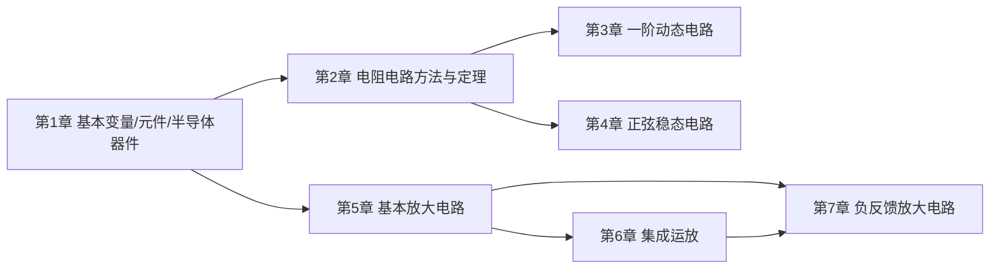

# 电路与电子学基础期末救命复习资料

> 范围锁定：课程第 1 章到第 7 章，也就是一直到“负反馈放大电路”。第 6 章集成运放、第 7 章负反馈都在考试范围内。  
> 目标：不追求百科全书式完整，而是用最短路径建立“能判断、会套公式、能写过程、能拿分”的能力。  
> 来源：课件、期末串讲、作业与作业答案、2023-2025 期末卷、2021/2026 期中卷、2017-2018 期末答案。

## 1. 使用说明

如果你现在几乎没学过，按这个顺序读：

1. 先看“提分优先级”，知道哪些题最值分。
2. 按“题型索引”找自己不会的题型。
3. 主体第 1-7 章只抓“考什么、公式、步骤、例题、易错点”。
4. 最后背“判断/填空速记”和“公式速查”。

如果只剩 1-2 天，优先顺序是：

1. 第 2 章戴维南/诺顿/最大功率。
2. 第 3 章一阶动态电路。
3. 第 4 章正弦功率与谐振。
4. 第 5 章共射放大。
5. 第 6 章运放。
6. 第 7 章负反馈。

## 2. 提分优先级

### S 级：必须会，计算题高概率

| 模块 | 你必须会什么 |
|---|---|
| 戴维南/诺顿 | 求 $U_{oc}$、$I_{sc}$、$R_{eq}$，含受控源会用外加电源法 |
| 最大功率 | 直流 $R_L=R_{eq}$，交流共轭匹配 $Z_L=Z_{eq}^*$ |
| 一阶电路 | 会用三要素法写 $y(t)=y(\infty)+[y(0^+)-y(\infty)]e^{-t/\tau}$ |
| 正弦功率 | 会算 $P,Q,S,\lambda$，会判断感性/容性 |
| 二极管/稳压管 | 会判断导通截止，稳压管会校验 $I_{Z\min}\le I_Z\le I_{Z\max}$ |
| 共射放大 | 会算 Q 点、$A_u,R_i,R_o$，会判断失真 |
| 运放 | 会用虚短虚断列节点方程，会算比例、加减、积分、限幅 |
| 负反馈 | 会判断正负反馈、四种组态，会说对 $A,R_i,R_o$ 的影响 |

### A 级：选择/填空高频

- KCL/KVL 的适用范围和独立方程数。
- 功率正负与参考方向。
- 理想电压源、电流源不能互换；实际源可以等效变换。
- 电容电压、电感电流换路瞬间不能跃变。
- 直流稳态：电容开路，电感短路。
- 高频极限：电容近似短路，电感近似开路。
- 三极管放大/截止/饱和区判断。
- 射极输出器：$A_u\approx 1$，输入电阻大，输出电阻小。
- 负反馈：降低增益，提高稳定性。

### B 级：了解即可

- 图论术语：图、树、连支。
- 三相电路：课件标注“不讲，了解”。
- 传输函数、滤波、波特图：以概念为主。
- 差分放大：掌握差模、共模、共模抑制比。

## 3. 题型索引

| 题目特征 | 翻哪里 |
|---|---|
| 求等效电路、开路电压、短路电流 | 第 2 章，例题 2 |
| 求负载最大功率 | 第 2 章，例题 3 |
| 开关在 $t=0$ 动作，求 $u_C(t)$、$i_L(t)$ | 第 3 章，例题 4 |
| 出现正弦量、相量、阻抗 | 第 4 章 |
| 求 $P,Q,S,\lambda$，判断容性/感性 | 第 4 章，例题 5 |
| 说“谐振”、电压电流同相 | 第 4 章，例题 6 |
| 二极管导通/截止、输出电压 | 第 1 章，例题 1 |
| 稳压管限流电阻范围 | 第 1 章，例题 1 后半 |
| 三极管 Q 点、共射放大倍数 | 第 5 章，例题 7 |
| 输出波形削顶/削底 | 第 5 章 |
| 运放比例、加减、积分、限幅 | 第 6 章，例题 8-10 |
| 反馈类型、闭环增益、稳定性 | 第 7 章，例题 11-12 |

## 4. 课程章节地图

---

# 课程第 1 章：电路模型、基本变量、基本元件与半导体器件

## 1.1 考什么

- 电压、电流、功率的参考方向。
- KCL/KVL。
- 电阻、电源、受控源的基本性质。
- 二极管、稳压管、三极管的基本判断。

## 1.2 基本定义

电流：
$$
i(t)=\frac{dq(t)}{dt}
$$

电压：
$$
u_{ab}=\frac{dw}{dq}
$$

关联参考方向：电流从电压参考正端流入，此时吸收功率
$$
p=ui
$$

若 $p>0$，元件吸收功率；若 $p<0$，元件实际供出功率。

电能：
$$
W=Pt
$$

$$
1\text{ 度}=1\text{ kW}\cdot\text{h}=3.6\times10^6\text{ J}
$$

KCL：
$$
\sum i=0
$$

KVL：
$$
\sum u=0
$$

KCL/KVL 与元件线性无关，直流、交流瞬时值、正弦稳态相量都可用。

## 1.3 拓扑术语

- 节点：两条或多条支路的连接点。理想导线直接相连的一片区域可视为同一节点。
- 支路：连接两个节点的一段电路，支路中流过同一个电流。一个二端元件可以是一条支路；若几个元件串联且中间没有分叉，也可整体看成一条支路。
- 回路：从某节点出发又回到该节点的闭合路径。
- 网孔：内部不含其他支路的最小回路。

若电路有 $n$ 个节点、$b$ 条支路：
$$
\text{独立 KCL 方程数}=n-1
$$
$$
\text{独立 KVL 方程数}=b-n+1
$$

## 1.4 电阻、电源、受控源

电阻：
$$
u=Ri,\qquad p=i^2R=\frac{u^2}{R}
$$

串联：
$$
R_{eq}=\sum R
$$

并联：
$$
\frac{1}{R_{eq}}=\sum\frac{1}{R}
$$

实际电压源和实际电流源等效：
$$
U_s\text{ 串联 }R_s
\Longleftrightarrow
I_s=\frac{U_s}{R_s}\text{ 并联 }R_s
$$

注意：理想电压源和理想电流源不能等效变换。

受控源：

- VCVS：电压控制电压源。
- VCCS：电压控制电流源。
- CCVS：电流控制电压源。
- CCCS：电流控制电流源。

含受控源时：

- 叠加定理中受控源不能置零。
- 求等效电阻时受控源必须保留。
- 常用外加电源法求 $R_{eq}$。

## 1.5 二极管与稳压管

硅二极管恒压降模型：
$$
U_D\approx0.7\text{ V}
$$

二极管题步骤：

1. 先假设二极管截止，拆掉二极管。
2. 求阳极、阴极电位。
3. 若 $V_A-V_K>0.7\text{ V}$，导通；否则截止。
4. 导通后用 $0.7\text{ V}$ 电压源替代，再算电流电压。

稳压管正常稳压时工作在反向击穿区：
$$
I_R=\frac{U_S-U_Z}{R}
$$
$$
I_L=\frac{U_Z}{R_L}
$$
$$
I_Z=I_R-I_L
$$

正常稳压条件：
$$
I_{Z\min}\le I_Z\le I_{Z\max}
$$

限流电阻范围：
$$
\frac{U_S-U_Z}{I_{Z\max}+I_L}\le R\le
\frac{U_S-U_Z}{I_{Z\min}+I_L}
$$

## 1.6 三极管基础

以 NPN 硅管为例：

| 状态 | 发射结 | 集电结 | 特点 |
|---|---|---|---|
| 放大区 | 正偏 | 反偏 | $I_C=\beta I_B$ |
| 截止区 | 反偏 | 反偏 | 近似无电流 |
| 饱和区 | 正偏 | 正偏 | $U_{CE}$ 很小 |

常用：
$$
U_{BE}\approx0.7\text{ V}
$$
$$
I_C=\beta I_B,\qquad I_E=(1+\beta)I_B
$$

## 1.7 例题 1：二极管与稳压管

### 考什么

判断导通截止，计算输出电压、电流，校验稳压管是否正常稳压。

### 例题 1A：二极管电流

电源 $5\text{ V}$，串联 $R=1\text{ k}\Omega$，硅二极管导通压降 $0.7\text{ V}$。求二极管电流。

解：
$$
i_D=\frac{5-0.7}{1\text{ k}\Omega}=4.3\text{ mA}
$$

### 例题 1B：稳压管限流电阻

已知 $U_Z=6\text{ V}$，$I_{Z\min}=10\text{ mA}$，$I_{Z\max}=90\text{ mA}$，$R_L=600\Omega$，串联限流电阻两端电压为 $2\text{ V}$，求 $R$ 范围。

解：
$$
I_L=\frac{6}{600}=10\text{ mA}
$$

$$
I_R=I_Z+I_L
$$

因此
$$
I_R\in[20,100]\text{ mA}
$$

$$
R_{\min}=\frac{2}{0.1}=20\Omega
$$

$$
R_{\max}=\frac{2}{0.02}=100\Omega
$$

$$
20\Omega\le R\le100\Omega
$$

### 易错点

- 二极管截止时不是 $0.7\text{ V}$，而是开路。
- 稳压管不是只要接反就稳压，必须满足电流范围。
- 三极管两个 PN 结都正偏是饱和，不是放大。

---

# 课程第 2 章：电阻电路分析方法与基本定理

## 2.1 考什么

- 电阻与电源等效变换。
- 节点电压法。
- 叠加定理。
- 戴维南/诺顿等效。
- 最大功率传输。

## 2.2 节点电压法

选参考节点，其余节点电压为未知量。

标准形式：
$$
G_{kk}V_k-\sum_{j\ne k}G_{kj}V_j=I_{sk}
$$

其中：

- $G_{kk}$：接在节点 $k$ 上的电导之和。
- $G_{kj}$：节点 $k$ 与 $j$ 之间的电导。
- $I_{sk}$：注入节点 $k$ 的电流源代数和。

## 2.3 叠加定理

线性电路中，某电压或电流响应等于各独立源单独作用时响应的代数和。

独立源置零规则：

- 电压源置零：短路。
- 电流源置零：开路。
- 受控源：保留。

注意：功率不能直接叠加。

## 2.4 戴维南与诺顿

戴维南等效：
$$
U_{oc}\text{ 串联 }R_{eq}
$$

诺顿等效：
$$
I_{sc}\text{ 并联 }R_{eq}
$$

关系：
$$
R_{eq}=\frac{U_{oc}}{I_{sc}},\qquad I_N=\frac{U_{oc}}{R_{eq}}
$$

求解步骤：

1. 断开负载，求开路电压 $U_{oc}$。
2. 短路端口，求短路电流 $I_{sc}$，或独立源置零求 $R_{eq}$。
3. 含受控源时，用外加电源法或 $R_{eq}=U_{oc}/I_{sc}$。
4. 画等效电路。

## 2.5 最大功率传输

直流电阻负载：
$$
R_L=R_{eq}
$$

$$
P_{\max}=\frac{U_{oc}^2}{4R_{eq}}
$$

交流阻抗负载，若实部虚部都可调：
$$
Z_L=Z_{eq}^*
$$

$$
P_{\max}=\frac{|U_{oc}|^2}{4R_{eq}}
$$

这里 $U_{oc}$ 是有效值相量。

## 2.6 例题 2：含受控源戴维南/诺顿

### 考什么

含受控源时，不能简单把受控源关掉；必须通过方程求 $U_{oc}$、$I_{sc}$ 或用外加电源法。

### 解题步骤

1. 开路端口求 $U_{oc}$。
2. 短路端口求 $I_{sc}$。
3. 用
$$
R_{eq}=\frac{U_{oc}}{I_{sc}}
$$
4. 写戴维南和诺顿等效。

### 例题

某题已求得：
$$
U_{oc}=10\text{ V},\qquad I_{sc}=20\text{ A}
$$

则：
$$
R_{eq}=\frac{10}{20}=0.5\Omega
$$

戴维南等效：$10\text{ V}$ 电压源串联 $0.5\Omega$。  
诺顿等效：$20\text{ A}$ 电流源并联 $0.5\Omega$。

### 易错点

- 求 $R_{eq}$ 时受控源不能置零。
- 端口电压、电流方向要统一，否则 $R_{eq}$ 符号会错。

## 2.7 例题 3：最大功率

某二端网络的戴维南等效为 $U_{oc}=1.5\text{ V}$，$R_{eq}=0.5\Omega$。求最大功率与负载。

解：
$$
R_L=R_{eq}=0.5\Omega
$$

$$
P_{\max}=\frac{1.5^2}{4\times0.5}=1.125\text{ W}
$$

---

# 课程第 3 章：动态电路的时域分析

## 3.1 考什么

- 电容、电感 VCR。
- 换路定则。
- 初始值、稳态值、时间常数。
- 零输入、零状态、全响应、暂态、稳态。

## 3.2 电容与电感

电容：
$$
i_C=C\frac{du_C}{dt}
$$
$$
W_C=\frac{1}{2}Cu_C^2
$$
$$
u_C(0^+)=u_C(0^-)
$$

电感：
$$
u_L=L\frac{di_L}{dt}
$$
$$
W_L=\frac{1}{2}Li_L^2
$$
$$
i_L(0^+)=i_L(0^-)
$$

直流稳态：

- 电容开路。
- 电感短路。

## 3.3 时间常数

RC：
$$
\tau=R_{eq}C
$$

RL：
$$
\tau=\frac{L}{R_{eq}}
$$

求 $R_{eq}$ 时，从动态元件两端看进去：

- 独立电压源短路。
- 独立电流源开路。
- 受控源保留。

## 3.4 三要素法

一阶电路最重要公式：
$$
y(t)=y(\infty)+[y(0^+)-y(\infty)]e^{-t/\tau}
$$

步骤：

1. 画 $0^-$ 电路，求状态变量 $u_C(0^-)$ 或 $i_L(0^-)$。
2. 用换路定则得到 $u_C(0^+)$、$i_L(0^+)$。
3. 画 $0^+$ 电路，求目标量初始值 $y(0^+)$。
4. 画 $\infty$ 电路，求 $y(\infty)$。
5. 求 $\tau$。
6. 代公式。

响应分类：

- 全响应 = 零输入响应 + 零状态响应。
- 暂态响应：
$$
[y(0^+)-y(\infty)]e^{-t/\tau}
$$
- 稳态响应：
$$
y(\infty)
$$

## 3.5 例题 4：一阶 RC 三要素

### 考什么

求 $u_C(t)$ 的零输入、零状态、全响应。

### 例题

已知：
$$
u_C(0^+)=-2\text{ V},\qquad u_C(\infty)=5\text{ V}
$$
$$
R_{eq}=1\text{ k}\Omega,\qquad C=4\mu\text{F}
$$

求 $u_C(t)$。

解：
$$
\tau=R_{eq}C=1\times10^3\times4\times10^{-6}=4\times10^{-3}\text{ s}
$$

$$
\frac{1}{\tau}=250
$$

零输入响应：
$$
u_{C,\text{zir}}(t)=-2e^{-250t}\text{ V}
$$

零状态响应：
$$
u_{C,\text{zsr}}(t)=5(1-e^{-250t})\text{ V}
$$

全响应：
$$
u_C(t)=-2e^{-250t}+5(1-e^{-250t})
$$
$$
u_C(t)=5-7e^{-250t}\text{ V}
$$

### 易错点

- $u_C(0^-)$ 只能直接推出 $u_C(0^+)$，不能直接推出任意支路电压。
- 非状态变量的 $y(0^+)$ 要画 $0^+$ 电路重新求。
- 同一一阶电路各量时间常数相同。

---

# 课程第 4 章：正弦稳态电路分析

## 4.1 考什么

- 正弦量三要素与有效值。
- 相量表示。
- 阻抗和导纳。
- 正弦功率。
- RLC 谐振。

## 4.2 正弦量与相量

$$
x(t)=X_m\cos(\omega t+\varphi)
$$

有效值：
$$
X=\frac{X_m}{\sqrt2}
$$

有效值相量：
$$
\dot X=X\angle\varphi
$$

正弦转余弦：
$$
\sin(\omega t+\varphi)=\cos(\omega t+\varphi-90^\circ)
$$

负振幅处理：
$$
-X_m\cos(\omega t+\varphi)=X_m\cos(\omega t+\varphi+180^\circ)
$$

## 4.3 阻抗

$$
Z_R=R
$$
$$
Z_L=j\omega L
$$
$$
Z_C=\frac{1}{j\omega C}=-\frac{j}{\omega C}
$$

相量欧姆定律：
$$
\dot U=Z\dot I
$$

## 4.4 正弦功率

设：
$$
u(t)=\sqrt2U\cos(\omega t+\theta_u)
$$
$$
i(t)=\sqrt2I\cos(\omega t+\theta_i)
$$

相位差：
$$
\varphi=\theta_u-\theta_i
$$

有功功率：
$$
P=UI\cos\varphi
$$

无功功率：
$$
Q=UI\sin\varphi
$$

视在功率：
$$
S=UI
$$

功率因数：
$$
\lambda=\cos\varphi
$$

判断：

- $\varphi>0$：感性，$Q>0$。
- $\varphi<0$：容性，$Q<0$。

有些答案只写 $|Q|$，再注明容性/感性，也可以。

## 4.5 RLC 谐振

串联 RLC：
$$
Z=R+j\left(\omega L-\frac{1}{\omega C}\right)
$$

谐振条件：
$$
\omega L=\frac{1}{\omega C}
$$

谐振角频率：
$$
\omega_0=\frac{1}{\sqrt{LC}}
$$

谐振时：

- 总阻抗为纯电阻。
- 电压与电流同相。
- 电流最大。
- 电感、电容电压大小相等、相位相反。

## 4.6 例题 5：正弦功率

已知：
$$
u(t)=40\cos(100t+60^\circ)\text{ V}
$$
$$
i(t)=10\cos(100t+90^\circ)\text{ A}
$$

求 $P,Q,S,\lambda$，判断性质。

解：
$$
U=\frac{40}{\sqrt2},\qquad I=\frac{10}{\sqrt2}
$$

$$
\varphi=60^\circ-90^\circ=-30^\circ
$$

$$
S=UI=200\text{ VA}
$$

$$
P=UI\cos(-30^\circ)=100\sqrt3\text{ W}
$$

$$
Q=UI\sin(-30^\circ)=-100\text{ var}
$$

所以网络呈容性。

$$
\lambda=\cos(-30^\circ)=\frac{\sqrt3}{2}
$$

## 4.7 例题 6：谐振求元件

已知：
$$
u(t)=100\sqrt2\cos t\text{ V}
$$

电流与电压同相，电感电压有效值 $20\text{ V}$，电流有效值 $2\text{ A}$。求 $R,L,C$。

解：

谐振时总阻抗为 $R$：
$$
R=\frac{100}{2}=50\Omega
$$

$$
X_L=\frac{20}{2}=10\Omega
$$

因为 $\omega=1$，所以
$$
L=\frac{X_L}{\omega}=10\text{ H}
$$

$$
C=\frac{1}{\omega^2L}=0.1\text{ F}
$$

## 4.8 了解项：三相、传输函数与滤波

传输函数：
$$
H(j\omega)=\frac{\dot U_o}{\dot U_i}
$$

分贝：
$$
20\log_{10}|H(j\omega)|\text{ dB}
$$

滤波器：

- 低通：低频过，高频衰减。
- 高通：高频过，低频衰减。
- 带通：中间频带过。
- 带阻：中间频带被抑制。

三相电路了解：
$$
P=\sqrt3U_LI_L\cos\varphi
$$

---

# 课程第 5 章：基本放大电路

## 5.1 考什么

- 共射放大电路直流通路、交流通路、微变等效。
- 静态工作点。
- 电压放大倍数、输入电阻、输出电阻。
- 饱和/截止失真。
- 射极输出器、多级放大、差分放大。

## 5.2 共射放大电路

阻容耦合：

- 直流：电容开路。
- 交流：电容短路，直流电源交流接地。

固定偏置：
$$
I_{BQ}=\frac{V_{CC}-U_{BEQ}}{R_B}
$$
$$
I_{CQ}=\beta I_{BQ}
$$
$$
U_{CEQ}=V_{CC}-I_{CQ}R_C
$$

分压式偏置：
$$
V_B=\frac{R_{B2}}{R_{B1}+R_{B2}}V_{CC}
$$
$$
V_E=V_B-U_{BEQ}
$$
$$
I_E=\frac{V_E}{R_E}
$$
$$
I_C\approx I_E
$$
$$
U_{CEQ}=V_{CC}-I_CR_C-I_ER_E
$$

温度稳定过程：

$$
T\uparrow \Rightarrow I_C\uparrow \Rightarrow I_E\uparrow
\Rightarrow U_E\uparrow \Rightarrow U_{BE}\downarrow
\Rightarrow I_B\downarrow \Rightarrow I_C\downarrow
$$

## 5.3 共射微变等效

常用：
$$
r_{be}\approx r_{bb'}+(1+\beta)\frac{26\text{ mV}}{I_E}
$$

若 $I_E$ 用 mA：
$$
r_{be}\approx r_{bb'}+(1+\beta)\frac{26\Omega}{I_E(\text{mA})}
$$

发射极旁路电容有效时：
$$
A_u=-\frac{\beta(R_C\parallel R_L)}{r_{be}}
$$
$$
R_i=R_{B1}\parallel R_{B2}\parallel r_{be}
$$
$$
R_o\approx R_C
$$

若发射极电阻未旁路：
$$
A_u\approx-\frac{\beta(R_C\parallel R_L)}{r_{be}+(1+\beta)R_E}
$$

此时电流串联负反馈使放大倍数降低、稳定性提高。

## 5.4 例题 7：共射放大

已知：
$$
R_{B1}=80\text{ k}\Omega,\quad R_{B2}=80\text{ k}\Omega
$$
$$
R_C=1\text{ k}\Omega,\quad R_E=1\text{ k}\Omega,\quad R_L=1\text{ k}\Omega
$$
$$
V_{CC}=15\text{ V},\quad \beta=50,\quad r_{be}=1\text{ k}\Omega
$$

求 Q 点、$A_u,R_i,R_o$。发射极旁路电容对交流短路。

解：
$$
V_B=\frac{80}{80+80}\times15=7.5\text{ V}
$$

$$
V_E=7.5-0.7=6.8\text{ V}
$$

$$
I_E=\frac{6.8}{1\text{ k}\Omega}=6.8\text{ mA}
$$

$$
I_B=\frac{6.8}{51}=0.133\text{ mA}
$$

$$
I_C\approx6.7\text{ mA}
$$

$$
U_{CEQ}\approx15-6.7-6.8=1.5\text{ V}
$$

$$
R_C\parallel R_L=0.5\text{ k}\Omega
$$

$$
A_u=-\frac{50\times0.5\text{ k}\Omega}{1\text{ k}\Omega}=-25
$$

$$
R_i\approx1\text{ k}\Omega,\qquad R_o\approx1\text{ k}\Omega
$$

## 5.5 失真判断

共射输出与输入反相。

- 输出底部削平：通常是饱和失真。
- 输出顶部削平：通常是截止失真。

饱和失真：降低 Q 点或减小输入幅度。  
截止失真：提高 Q 点或减小输入幅度。

## 5.6 射极输出器

又叫共集电极电路、电压跟随器。

特点：

- $A_u\approx1$。
- 输入输出同相。
- 输入电阻大。
- 输出电阻小。
- 带负载能力强。

更精确：
$$
A_u=\frac{(1+\beta)R_L'}{r_{be}+(1+\beta)R_L'}
$$

$$
R_L'=R_E\parallel R_L
$$

## 5.7 多级放大与差分放大

多级放大总增益：
$$
A_u=A_{u1}A_{u2}\cdots A_{un}
$$

输入电阻为第一级输入电阻。  
输出电阻为最后一级输出电阻。

差模输入：
$$
u_{id}=u_{i1}-u_{i2}
$$

共模输入：
$$
u_{ic}=\frac{u_{i1}+u_{i2}}{2}
$$

共模抑制比：
$$
K_{CMR}=\left|\frac{A_d}{A_c}\right|
$$

分贝：
$$
20\log_{10}K_{CMR}
$$

---

# 课程第 6 章：集成运算放大电路

## 6.1 考什么

- 理想运放虚短、虚断。
- 反相比例、同相比例、电压跟随器。
- 反相加法、加减运算。
- 积分、微分。
- 输出限幅/饱和。
- 运放级联和 DAC。

## 6.2 理想运放

在线性负反馈状态下：
$$
u_+=u_-
$$
$$
i_+=i_-=0
$$

理想参数：
$$
A_{od}\to\infty,\qquad R_i\to\infty,\qquad R_o\to0
$$

注意：虚短不是短路，虚断不是没有关系。

## 6.3 比例运算

反相比例：
$$
u_o=-\frac{R_f}{R}u_i
$$

输入电阻：
$$
R_i=R
$$

同相比例：
$$
u_o=\left(1+\frac{R_f}{R}\right)u_i
$$

电压跟随器：
$$
u_o=u_i
$$

## 6.4 加减运算

反相加法：
$$
u_o=-R_f\left(\frac{u_{i1}}{R_1}+\frac{u_{i2}}{R_2}+\cdots\right)
$$

通用步骤：

1. 找反相端 $N$、同相端 $P$。
2. 写节点 KCL。
3. 用 $u_N=u_P$、$i_N=i_P=0$。
4. 整理 $u_o$。

## 6.5 积分与微分

反相积分：
$$
u_o(t)=-\frac{1}{RC}\int u_i(t)\,dt+u_o(0)
$$

反相微分：
$$
u_o(t)=-RC\frac{du_i(t)}{dt}
$$

若算出输出超过运放最大幅值，则进入饱和，实际输出取限幅值。

## 6.6 例题 8：反相加法

已知：
$$
R_f=100\text{ k}\Omega,\quad R_1=50\text{ k}\Omega,\quad R_2=50\text{ k}\Omega,\quad R_3=20\text{ k}\Omega
$$

某电路关系为：
$$
u_o=-\frac{R_f}{R_1}u_{i1}-\frac{R_f}{R_2}u_{i2}
+\frac{R_f}{R_3}u_{i3}
$$

则：
$$
u_o=-2u_{i1}-2u_{i2}+5u_{i3}
$$

## 6.7 例题 9：运放设计

要求：
$$
A_u=-4,\qquad R_i=10\text{ k}\Omega
$$

采用反相比例：
$$
A_u=-\frac{R_f}{R_1}
$$

$$
R_1=R_i=10\text{ k}\Omega
$$

$$
R_f=4R_1=40\text{ k}\Omega
$$

平衡电阻：
$$
R'=R_1\parallel R_f=8\text{ k}\Omega
$$

## 6.8 例题 10：级联运放

第一级同相比例：
$$
R_1=10\text{ k}\Omega,\quad R_2=100\text{ k}\Omega
$$

第二级反相比例：
$$
R_4=100\text{ k}\Omega,\quad R_5=?
$$

总关系：
$$
u_o=-55u_i
$$

解：
$$
u_{o1}=\left(1+\frac{100}{10}\right)u_i=11u_i
$$

$$
u_o=-\frac{R_5}{100\text{ k}\Omega}\cdot11u_i=-55u_i
$$

$$
R_5=500\text{ k}\Omega
$$

若第一级变为反相比例：
$$
u_{o1}=-10u_i
$$

第二级仍为 $-5$ 倍：
$$
u_o=50u_i
$$

## 6.9 DAC 速记

反相加权求和：
$$
v_o=-R_F\sum_k\frac{d_kV_{REF}}{R_k}
$$

四位二进制权重常见形式：
$$
v_o=-\frac{V_{REF}}{2^4}(d_3 2^3+d_2 2^2+d_1 2^1+d_0)
$$

若 $V_{REF}=-3.2\text{ V}$，$d_3d_2d_1d_0=1100$，则：
$$
v_o=-\frac{-3.2}{16}(8+4)=2.4\text{ V}
$$

---

# 课程第 7 章：负反馈放大电路

## 7.1 考什么

- 判断有没有反馈、正反馈还是负反馈。
- 判断四种组态。
- 会写闭环放大倍数。
- 会说负反馈对输入电阻、输出电阻、稳定性、失真的影响。
- 会按目的选择反馈类型。
- 自激振荡条件。

## 7.2 基本概念

反馈：把输出量的一部分或全部送回输入端。

开环：无反馈通路。  
闭环：存在反馈通路。

负反馈判断核心：输入量不变时，反馈使净输入量减小。

框图关系：
$$
X_i'=X_i-X_f
$$
$$
X_o=AX_i'
$$
$$
X_f=FX_o
$$

闭环放大倍数：
$$
A_f=\frac{A}{1+AF}
$$

深度负反馈：
$$
AF\gg1,\qquad A_f\approx\frac{1}{F}
$$

## 7.3 正负反馈判断

瞬时极性法：

1. 假设输入瞬时极性。
2. 沿基本放大电路判断输出极性。
3. 沿反馈网络判断反馈量极性。
4. 若净输入减小，是负反馈；若净输入增大，是正反馈。

## 7.4 四种交流负反馈组态

先看输出端，再看输入端。

输出端：

- 反馈量取自输出电压：电压反馈。
- 反馈量取自输出电流：电流反馈。

输出短路法：

- 将负载短路后反馈量消失：电压反馈。
- 将负载短路后反馈量仍存在：电流反馈。

输入端：

- 反馈量与输入量以电压形式相减：串联反馈。
- 反馈量与输入量以电流形式相减：并联反馈。

四种组态：

| 组态 | 输出端 | 输入端 | 作用倾向 |
|---|---|---|---|
| 电压串联负反馈 | 稳定输出电压 | 增大输入电阻 | 电压输入、电压输出 |
| 电压并联负反馈 | 稳定输出电压 | 减小输入电阻 | 电流输入、电压输出 |
| 电流串联负反馈 | 稳定输出电流 | 增大输入电阻 | 电压输入、电流输出 |
| 电流并联负反馈 | 稳定输出电流 | 减小输入电阻 | 电流输入、电流输出 |

## 7.5 负反馈对性能的影响

增益降低：
$$
A_f=\frac{A}{1+AF}
$$

稳定性提高：
$$
\frac{dA_f/A_f}{dA/A}=\frac{1}{1+AF}
$$

串联负反馈：
$$
R_{if}=(1+AF)R_i
$$

并联负反馈：
$$
R_{if}=\frac{R_i}{1+AF}
$$

电压负反馈：
$$
R_{of}=\frac{R_o}{1+AF}
$$

电流负反馈：
$$
R_{of}=(1+AF)R_o
$$

其他影响：

- 减小非线性失真。
- 展宽通频带。
- 抑制温漂和噪声的一部分影响。
- 代价是放大倍数降低。

## 7.6 按目的选择反馈

| 目的 | 选择 |
|---|---|
| 稳定静态工作点 | 直流负反馈 |
| 稳定放大倍数 | 交流负反馈 |
| 稳定输出电压 | 电压负反馈 |
| 稳定输出电流 | 电流负反馈 |
| 增大输入电阻 | 串联负反馈 |
| 减小输入电阻 | 并联负反馈 |
| 减小输出电阻 | 电压负反馈 |
| 增大输出电阻 | 电流负反馈 |
| 输入电流控制输出电压 | 电压并联负反馈 |
| 输入电压控制输出电流 | 电流串联负反馈 |
| 输入电流控制输出电流 | 电流并联负反馈 |
| 输入电压控制输出电压 | 电压串联负反馈 |

## 7.7 自激振荡

自激振荡条件：
$$
\dot A\dot F=-1
$$

振幅平衡：
$$
|\dot A\dot F|=1
$$

相位平衡：
$$
\varphi_A+\varphi_F=(2n+1)\pi
$$

正弦波振荡器基本环节：

- 放大电路。
- 正反馈电路。
- 选频电路。
- 稳幅电路。

## 7.8 例题 11：反馈稳定性计算

已知：
$$
A=10^5,\qquad F=2\times10^{-3}
$$

求 $A_f$。若 $A$ 相对变化率为 $20\%$，求 $A_f$ 相对变化率。

解：
$$
AF=10^5\times2\times10^{-3}=200
$$

$$
A_f=\frac{10^5}{1+200}\approx497.5\approx500
$$

$$
\frac{dA_f}{A_f}=\frac{1}{1+AF}\frac{dA}{A}
$$

$$
\frac{dA_f}{A_f}=\frac{20\%}{201}\approx0.1\%
$$

## 7.9 例题 12：反馈组态判断

### 解题模板

1. 先判断正负反馈：看反馈是否使净输入减小。
2. 再看输出端：短路负载，反馈消失就是电压反馈，不消失就是电流反馈。
3. 最后看输入端：电压相减是串联反馈，电流相减是并联反馈。

### 串讲同款结论

如果将负载 $R_L$ 开路或短路后，反馈量与输出电流有关，且反馈电流与输入电流在输入端求差，则为：

$$
\text{电流并联负反馈}
$$

### 易错点

- 组态名称顺序是“输出端 + 输入端”，不是反过来。
- 电压/电流反馈看输出端；串联/并联反馈看输入端。
- 判断反馈正负不能只看有没有反馈电阻，要看净输入量变大还是变小。

---

# 高频例题精讲

## 例题 A：功率正负与参考方向

某支路供出功率 $50\text{ W}$，电流 $i=10\text{ A}$。按关联参考方向假设，求电压。

解：
$$
p=-50\text{ W}
$$
$$
p=ui
$$
$$
u=\frac{-50}{10}=-5\text{ V}
$$

负号说明真实极性与假设相反。

## 例题 B：相量阻抗

已知 $\omega=1000\text{ rad/s}$，
$$
L=2\text{ mH},\quad C=1\text{ mF},\quad R=5\Omega
$$

若电感与电容并联后再与电阻串联，求 $Z_{ab}$。

解：
$$
Z_L=j\omega L=j2\Omega
$$
$$
Z_C=\frac{1}{j\omega C}=-j\Omega
$$
$$
Z_L\parallel Z_C=\frac{j2(-j)}{j2-j}=-2j
$$
$$
Z_{ab}=5-2j\Omega
$$

## 例题 C：积分波形

反相积分器：
$$
u_o(t)=-\frac{1}{RC}\int u_i(t)\,dt
$$

若：
$$
R=100\text{ k}\Omega,\quad C=0.1\mu\text{F}
$$

则：
$$
RC=0.01\text{ s},\qquad \frac{1}{RC}=100
$$

若 $0\sim5\text{ ms}$ 内 $u_i=5\text{ V}$，且 $u_o(0)=0$，则：
$$
u_o(t)=-100\int_0^t5\,d\xi=-500t
$$

$$
u_o(5\text{ ms})=-500\times0.005=-2.5\text{ V}
$$

---

# 判断/填空速记

1. KCL/KVL 与元件性质无关，非线性元件也适用。
2. 理想电压源和理想电流源不能等效变换。
3. 电压源置零是短路，电流源置零是开路。
4. 叠加定理中受控源必须保留。
5. 功率一般不能叠加。
6. 戴维南等效对外等效，不对内等效。
7. 最大功率传输不是最高效率。
8. 电容电压不能跃变，电感电流不能跃变。
9. 直流稳态电容开路、电感短路。
10. 高频极限电容短路、电感开路。
11. 时间常数越小，过渡过程越快。
12. 硅二极管导通压降常取 $0.7\text{ V}$。
13. 稳压管稳压时工作在反向击穿区。
14. 三极管放大区：发射结正偏，集电结反偏。
15. 三极管饱和区：发射结正偏，集电结正偏。
16. 共射放大输入输出反相。
17. 射极输出器 $A_u\approx1$，输入电阻大，输出电阻小。
18. 运放分析先写虚短、虚断。
19. 负反馈降低放大倍数，提高稳定性。
20. 串联负反馈增大输入电阻。
21. 并联负反馈减小输入电阻。
22. 电压负反馈减小输出电阻。
23. 电流负反馈增大输出电阻。
24. 反馈组态顺序：先输出端，后输入端。

---

# 公式速查

## 电路基础

$$
p=ui
$$
$$
u=Ri
$$
$$
\sum i=0,\qquad \sum u=0
$$

## 戴维南/诺顿

$$
R_{eq}=\frac{U_{oc}}{I_{sc}}
$$
$$
P_{\max}=\frac{U_{oc}^2}{4R_{eq}}
$$
$$
Z_L=Z_{eq}^*
$$

## 一阶电路

$$
i_C=C\frac{du_C}{dt}
$$
$$
u_L=L\frac{di_L}{dt}
$$
$$
\tau_{RC}=R_{eq}C
$$
$$
\tau_{RL}=\frac{L}{R_{eq}}
$$
$$
y(t)=y(\infty)+[y(0^+)-y(\infty)]e^{-t/\tau}
$$

## 正弦稳态

$$
X=\frac{X_m}{\sqrt2}
$$
$$
Z_R=R,\quad Z_L=j\omega L,\quad Z_C=\frac{1}{j\omega C}
$$
$$
P=UI\cos\varphi,\quad Q=UI\sin\varphi,\quad S=UI
$$
$$
\lambda=\cos\varphi
$$
$$
\omega_0=\frac{1}{\sqrt{LC}}
$$

## 二极管与三极管

$$
U_D\approx0.7\text{ V}
$$
$$
I_C=\beta I_B
$$
$$
U_{CEQ}=V_{CC}-I_CR_C-I_ER_E
$$
$$
A_u=-\frac{\beta(R_C\parallel R_L)}{r_{be}}
$$

## 运放

$$
u_+=u_-,\qquad i_+=i_-=0
$$
$$
u_o=-\frac{R_f}{R}u_i
$$
$$
u_o=\left(1+\frac{R_f}{R}\right)u_i
$$
$$
u_o=-R_f\sum_k\frac{u_{ik}}{R_k}
$$
$$
u_o(t)=-\frac{1}{RC}\int u_i(t)\,dt+u_o(0)
$$

## 负反馈

$$
A_f=\frac{A}{1+AF}
$$
$$
\frac{dA_f/A_f}{dA/A}=\frac{1}{1+AF}
$$
$$
R_{if,\text{串联}}=(1+AF)R_i
$$
$$
R_{if,\text{并联}}=\frac{R_i}{1+AF}
$$
$$
R_{of,\text{电压}}=\frac{R_o}{1+AF}
$$
$$
R_{of,\text{电流}}=(1+AF)R_o
$$

---

# 最后 72 小时复习路线

## 第 1 天：电路与动态

1. 背 KCL/KVL、功率正负、源等效。
2. 刷戴维南/诺顿、最大功率。
3. 刷一阶动态三要素。

目标：会写过程，先把大题基本分拿住。

## 第 2 天：正弦、二极管、三极管

1. 背相量、阻抗、功率公式。
2. 刷 $P,Q,S,\lambda$ 和谐振。
3. 刷二极管/稳压管。
4. 刷共射放大 Q 点和 $A_u,R_i,R_o$。

## 第 3 天：运放与负反馈

1. 背虚短虚断。
2. 刷反相、同相、加减、积分。
3. 背负反馈四组态表。
4. 刷反馈判断和闭环增益稳定性计算。
5. 最后看判断/填空速记。

---

# 临场避坑清单

1. 看到“置零”：电压源短路，电流源开路。
2. 看到“受控源”：不要关掉。
3. 看到功率：先确认参考方向和有效值。
4. 看到开关：先画 $0^-$、$0^+$、$\infty$。
5. 看到电容：记住 $u_C$ 连续。
6. 看到电感：记住 $i_L$ 连续。
7. 看到正弦功率：先算 $\varphi=\theta_u-\theta_i$。
8. 看到二极管：先假设状态，再检验。
9. 看到三极管：算出 $U_{CE}<0$ 就说明饱和。
10. 看到运放：先写 $u_+=u_-$、$i_+=i_-=0$。
11. 看到负反馈：先判断正负，再输出端判电压/电流，最后输入端判串联/并联。
12. 看到“第 7 章”：这是课程第 7 章负反馈，不是本资料旧编号。
