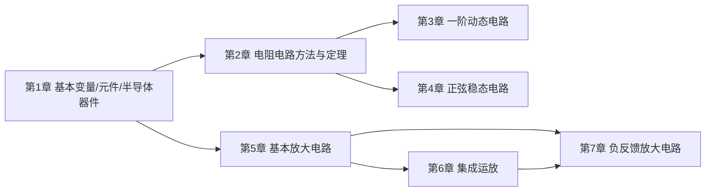

# 电路与电子学基础期末救命复习资料（完整应试版）

> 范围锁定：课程第 1 章到第 7 章，也就是一直到“负反馈放大电路”。第 6 章集成运放、第 7 章负反馈都在考试范围内。  
> 目标：完整覆盖课程第 1-7 章应试内容，同时保持题型导向；既能从零补知识，也能临考按例题刷过程。  
> 来源：课件、期末串讲、作业与作业答案、2023-2025 期末卷、2021/2026 期中卷、2017-2018 期末答案。

## 1. 使用说明

如果你现在几乎没学过，按这个顺序读：

1. 先看“提分优先级”，知道哪些题最值分。
2. 按“题型索引”找自己不会的题型。
3. 主体第 1-7 章按“考什么、概念、公式、题型、例题、易错点、考场写法”补全。
4. 最后背“判断/填空原话库”和“公式速查”。

如果只剩 1-2 天，优先顺序是：戴维南/诺顿、一阶三要素、正弦功率、二极管/稳压管、共射放大、运放、负反馈。

## 2. 提分优先级

### S 级：必须会，计算题高概率

| 模块 | 你必须会什么 | 主要出处 |
|---|---|---|
| 戴维南/诺顿 | 求 $U_{oc}$、$I_{sc}$、$R_{eq}$，含受控源会用外加电源法 | 作业 04、2025-2026 期中、2024-2025 期末 |
| 最大功率 | 直流 $R_L=R_{eq}$，交流共轭匹配 $Z_L=Z_{eq}^*$ | 作业 04、2025-2026 期中 |
| 一阶电路 | 会用三要素法写 $y(t)=y(\infty)+[y(0^+)-y(\infty)]e^{-t/	au}$ | 作业 05-06、2024-2025 期末 |
| 正弦功率 | 会算 $P,Q,S,\lambda$，会判断感性/容性 | 课件 4.4、期中/期末 |
| RLC 谐振 | 会判断 $X_L=X_C$，会求 $R,L,C$ | 课件 4.7、2025-2026 期中 |
| 二极管/稳压管 | 会判断导通截止，稳压管会校验 $I_{Z\min}\le I_Z\le I_{Z\max}$ | 作业 10、2024-2025 期末 |
| 共射放大 | 会算 Q 点、$A_u,R_i,R_o$，会判断失真 | 作业 12-13、2023-2025 期末 |
| 运放 | 会用虚短虚断列节点方程，会算比例、加减、积分、限幅、DAC | 作业 14-15、2023-2025 期末 |
| 负反馈 | 会判断正负反馈、四种组态，会说对 $A,R_i,R_o$ 的影响 | 作业 16、2023-2025 期末 |

### A 级：选择/填空高频

- KCL/KVL 的适用范围和独立方程数。
- 功率正负与参考方向。
- 理想电压源、电流源不能互换；实际源可以等效变换。
- 电容电压、电感电流换路瞬间不能跃变。
- 直流稳态：电容开路，电感短路。
- 高频极限：电容近似短路，电感近似开路。
- 三极管放大/截止/饱和区判断。
- 射极输出器：$A_upprox 1$，输入电阻大，输出电阻小。
- 负反馈：降低增益，提高稳定性，减小非线性失真，展宽通频带。

### B 级：了解即可

- 图论术语：图、树、连支。
- 三相电路：课件标注“不讲，了解”。
- 传输函数、滤波、波特图：以概念为主。
- 差分放大：掌握差模、共模、共模抑制比。

## 3. 题型索引

| 题目特征 | 翻哪里 | 考场第一步 |
|---|---|---|
| 求等效电路、开路电压、短路电流 | 课程第 2 章、例题库 1-3 | 先断开负载求 $U_{oc}$ |
| 求负载最大功率 | 课程第 2 章、例题库 4 | 先化戴维南等效 |
| 开关在 $t=0$ 动作 | 课程第 3 章、例题库 5-7 | 先写换路定则 |
| 出现正弦量、相量、阻抗 | 课程第 4 章、例题库 8-10 | 先转有效值相量 |
| 求 $P,Q,S,\lambda$ | 课程第 4 章 | 先判断电压电流相位差 |
| 二极管导通/截止、输出电压 | 课程第 1 章、例题库 11 | 先假设截止再验证 |
| 稳压管限流电阻范围 | 课程第 1 章、例题库 12 | 先算负载电流 |
| 三极管 Q 点、共射放大倍数 | 课程第 5 章、例题库 13-14 | 先分直流/交流通路 |
| 输出波形削顶/削底 | 课程第 5 章、例题库 15 | 先判断截止/饱和失真 |
| 运放比例、加减、积分、限幅 | 课程第 6 章、例题库 16-19 | 先写虚短虚断 |
| 反馈类型、闭环增益、稳定性 | 课程第 7 章、例题库 20-22 | 先输出取样，再输入混合 |

## 4. 课程章节地图

---

# 课程第 1 章：电路模型、基本变量、基本元件与半导体器件

## 1.1 电路模型、基本变量与 KCL/KVL

## 1.1 电路与电路模型

- 电路由电源、负载、导线、开关及元件组成。
- 激励：输入电路的信号，例如独立电压源、独立电流源。
- 响应：电路对激励产生的电压、电流、功率等输出量。
- 集中参数电路：电路尺寸远小于信号波长时使用普通 KCL/KVL 分析。
- 分布参数电路：电路尺寸与信号波长不可忽略时使用传输线模型。期中卷出现过“3000 km、50 Hz、省际交流电路”为分布参数电路。

## 1.2 电压、电流、功率

电流：
$$
i(t)=\frac{dq(t)}{dt}
$$

电压：
$$
u_{ab}=\frac{dw}{dq}
$$

关联参考方向：电流从电压参考正端流入。此时元件吸收功率
$$
p=ui
$$

若 $p>0$，元件吸收功率；若 $p<0$，元件实际供出功率。

非关联参考方向：电流从电压参考负端流入。此时如果仍用“吸收功率”定义，应写
$$
p=-ui
$$

电能：
$$
W=Pt
$$

常用换算：
$$
1\text{ 度}=1\text{ kW}\cdot\text{h}=3.6\times 10^6\text{ J}
$$

## 1.3 功率题处理办法

1. 先判断题目给的是“吸收功率”还是“供出功率”。
2. 建立电压、电流的关联参考方向。
3. 用 $p=ui$ 求符号。
4. 最后根据符号反推真实极性或真实方向。

### 例 1：供出功率求电压

某支路供出功率 $50\text{ W}$，电流 $i=10\text{ A}$。若先假设电压、电流为关联参考方向，求电压。

解：

供出功率 $50\text{ W}$ 等价于吸收功率
$$
p=-50\text{ W}
$$

关联参考方向下
$$
p=ui
$$

所以
$$
u=\frac{p}{i}=\frac{-50}{10}=-5\text{ V}
$$

负号说明真实电压极性与假定参考极性相反。

## 1.4 KCL 与 KVL

KCL：任一节点，流入电流代数和等于流出电流代数和：
$$
\sum i=0
$$

KCL 也可用于任一封闭面。

KVL：任一闭合回路，电压代数和为零：
$$
\sum u=0
$$

适用范围：

- KCL/KVL 与元件线性或非线性无关。
- 既适用于直流，也适用于交流瞬时值；在正弦稳态中也适用于相量。
- $n$ 个节点的电路最多有 $n-1$ 个独立 KCL 方程。

### 例 2：KCL 基本题

某节点有 $9\text{ A}$ 流入，$8\text{ A}$ 流出，未知电流 $i_2$ 按流出方向标注。则
$$
9=i_2+8
$$
$$
i_2=1\text{ A}
$$

若算出电流为负，表示真实方向与参考方向相反。

## 1.5 电路拓扑术语：节点、支路、回路、网孔

这些词是后面“支路电流法、节点电压法、网孔电流法”的语言基础。

节点：两条或多条支路的连接点。若干点之间用理想导线直接相连且无元件，可视为同一节点。

支路：连接两个节点的一段电路，支路中流过同一个电流。一个二端元件可以是一条支路；几个二端元件串联且中间没有分叉节点时，也可以整体看成一条支路。

回路：从某节点出发，沿支路走一圈又回到该节点的闭合路径。

网孔：内部不含其他支路的最小回路。

对一个有 $n$ 个节点、$b$ 条支路的连通电路：
$$
\text{独立 KCL 方程数}=n-1
$$

$$
\text{独立 KVL 方程数}=b-n+1
$$

---

## 1.2 基本元件、独立源与受控源

## 2.1 电阻

线性电阻：
$$
u=Ri,\qquad i=Gu,\qquad G=\frac{1}{R}
$$

功率：
$$
p=ui=i^2R=\frac{u^2}{R}
$$

串联：
$$
R_{\text{eq}}=\sum R_k
$$

分压：
$$
u_k=\frac{R_k}{\sum R}u
$$

并联：
$$
G_{\text{eq}}=\sum G_k,\qquad \frac{1}{R_{\text{eq}}}=\sum\frac{1}{R_k}
$$

两电阻并联：
$$
R_{\text{eq}}=\frac{R_1R_2}{R_1+R_2}
$$

分流：
$$
i_k=\frac{G_k}{\sum G}i
$$

两电阻并联时，大电阻分到的电流小；并联支路电压相等。

## 2.2 独立电源

理想电压源：端电压由电源决定，电流由外电路决定。理想电压源内阻为 $0$。

理想电流源：端电流由电源决定，电压由外电路决定。理想电流源内阻为 $\infty$。

理想电压源与理想电流源不能等效变换。

实际电压源与实际电流源可等效变换：

$$
U_s \text{ 串联 } R_s
\quad\Longleftrightarrow\quad
I_s=\frac{U_s}{R_s}\text{ 并联 } R_s
$$

注意电源方向。

## 2.3 受控源

受控源由控制量决定输出，不独立产生控制关系。常见四类：

- VCVS：电压控制电压源。
- VCCS：电压控制电流源。
- CCVS：电流控制电压源。
- CCCS：电流控制电流源。

含受控源的题目最重要的规则：

1. 叠加定理中，受控源不能置零，必须保留。
2. 求等效电阻时，独立源置零，受控源保留。
3. 含受控源时常用外加电源法求 $R_{\text{eq}}$。

### 例 3：受控源电路求等效电阻的核心套路

要求端口 $ab$ 等效电阻：

1. 将独立电压源短路，独立电流源开路。
2. 在 $ab$ 端外加电压 $u$，设流入电流为 $i$。
3. 保留受控源并用控制量列 KCL/KVL。
4. 求
$$
R_{\text{eq}}=\frac{u}{i}
$$

若算出负电阻，含源网络可能具有有源特性，不一定错。

---

## 1.3 半导体、二极管与稳压管

## 6.1 PN 结与二极管

二极管伏安特性非线性：

- 正向偏置超过门槛电压后导通。
- 反向偏置时近似截止，只有很小反向电流。
- 反向电压过大时击穿。

硅二极管正向导通压降通常取：
$$
U_D\approx 0.6\sim 0.7\text{ V}
$$

本课程计算题通常取 $0.7\text{ V}$。

## 6.2 二极管电路模型

理想模型：

- 导通：短路，$u_D=0$。
- 截止：开路，$i_D=0$。

恒压降模型：

- 导通：$u_D=0.7\text{ V}$。
- 截止：开路。

二极管题步骤：

1. 假设二极管截止，拆掉二极管。
2. 求二极管阳极、阴极电位。
3. 若 $V_A-V_K>0.7\text{ V}$，说明导通。
4. 导通后二极管替换为 $0.7\text{ V}$ 电压源，再算电流、电压。
5. 若有多个二极管，先判断谁最容易导通；必要时枚举状态并检验。

### 例 10：恒压降模型

电源 $5\text{ V}$，串联电阻 $R=1\text{ k}\Omega$，硅二极管导通压降 $0.7\text{ V}$。求二极管电流。

解：

$$
i_D=\frac{5-0.7}{1\text{ k}\Omega}=4.3\text{ mA}
$$

## 6.3 二极管逻辑电路

二极管可组成简单逻辑门。作业中出现过输入 $0\text{ V}$ 或 $5\text{ V}$ 的二极管“或”门：

| $U_1$ | $U_2$ | $U_o$ |
|---:|---:|---:|
| 0 | 0 | 0 |
| 0 | 5 | 5 |
| 5 | 0 | 5 |
| 5 | 5 | 5 |

若考虑硅管压降，输出高电平通常要减去约 $0.7\text{ V}$。

## 6.4 稳压二极管

稳压管正常稳压时工作在反向击穿区。此时电流变化较大，电压变化很小。

稳压电路核心公式：
$$
I_R=\frac{U_S-U_Z}{R}
$$
$$
I_L=\frac{U_Z}{R_L}
$$
$$
I_Z=I_R-I_L
$$

正常稳压条件：
$$
I_{Z\min}\le I_Z\le I_{Z\max}
$$

限流电阻范围：
$$
\frac{U_S-U_Z}{I_{Z\max}+I_L}\le R\le
\frac{U_S-U_Z}{I_{Z\min}+I_L}
$$

### 例 11：稳压管限流电阻

已知稳压管 $U_Z=6\text{ V}$，$I_{Z\min}=10\text{ mA}$，$I_{Z\max}=90\text{ mA}$，负载 $R_L=600\Omega$，电源与稳压管串联电阻上的电压为 $2\text{ V}$。求限流电阻范围。

解：

负载电流：
$$
I_L=\frac{U_Z}{R_L}=\frac{6}{600}=10\text{ mA}
$$

串联电阻电流：
$$
I_R=I_Z+I_L
$$

故
$$
I_R\in[10+10,\ 90+10]\text{ mA}=[20,\ 100]\text{ mA}
$$

串联电阻：
$$
R=\frac{2}{I_R}
$$

为了不超过最大稳压电流，用 $I_R=100\text{ mA}$ 得最小电阻：
$$
R_{\min}=\frac{2}{0.1}=20\Omega
$$

为了保证进入稳压区，用 $I_R=20\text{ mA}$ 得最大电阻：
$$
R_{\max}=\frac{2}{0.02}=100\Omega
$$

所以
$$
20\Omega\le R\le 100\Omega
$$

---

---

# 课程第 2 章：电阻电路分析方法与基本定理

## 2.1 支路电流法

对 $b$ 条支路、$n$ 个节点的电路：

- 列 $n-1$ 个独立 KCL 方程。
- 列 $b-n+1$ 个独立 KVL 方程。
- 用 VCR 将支路电压换成支路电流。

优点：通用。缺点：方程多。

## 2.2 节点电压法

选择参考节点，其他节点电压为未知量。

标准形式：
$$
G_{kk}V_k-\sum_{j\ne k}G_{kj}V_j=I_{sk}
$$

其中：

- $G_{kk}$：连接到节点 $k$ 的所有电导之和。
- $G_{kj}$：节点 $k$ 与节点 $j$ 之间的电导。
- $I_{sk}$：注入节点 $k$ 的独立电流源代数和。

处理技巧：

- 电压源接地：该节点电压直接已知。
- 电压源夹在两个非参考节点之间：用超节点。
- 受控源：把控制量用节点电压表示。

## 2.3 网孔电流法

选择每个网孔的假想网孔电流，对每个网孔列 KVL。

适合平面电路；本课程网孔法多为了解，重点不如节点法和戴维南定理。

## 2.4 叠加定理

在线性电路中，任一电压或电流响应等于各独立源单独作用时产生响应的代数和。

独立源单独作用：

- 其他独立电压源置零，即短路。
- 其他独立电流源置零，即开路。
- 受控源必须保留。

注意：功率不能直接叠加。因为
$$
p=i^2R
$$
不是线性关系。

### 例 4：线性无源网络比例性

线性无源网络中，某电流源为 $3\text{ A}$ 时，$5\Omega$ 电阻消耗功率为 $1\text{ W}$。若电流源变为 $9\text{ A}$，求该电阻功率。

解：

电流源变为原来的 $3$ 倍，线性网络中该电阻电流也变为原来的 $3$ 倍。

功率与电流平方成正比：
$$
P'=3^2P=9\times 1=9\text{ W}
$$

## 2.5 戴维南定理与诺顿定理

任意线性有源二端网络，对外可等效为：

戴维南等效：
$$
U_{oc}\text{ 串联 }R_{\text{eq}}
$$

诺顿等效：
$$
I_{sc}\text{ 并联 }R_{\text{eq}}
$$

两者关系：
$$
R_{\text{eq}}=\frac{U_{oc}}{I_{sc}},\qquad I_N=\frac{U_{oc}}{R_{\text{eq}}}
$$

求解步骤：

1. 断开负载，求开路电压 $U_{oc}$。
2. 求等效电阻 $R_{\text{eq}}$：
   - 无受控源：独立源置零后直接等效。
   - 有受控源：外加电源法或 $R_{\text{eq}}=U_{oc}/I_{sc}$。
3. 画等效电路。

## 2.6 最大功率传输

直流电阻负载：

负载获得最大功率条件：
$$
R_L=R_{\text{eq}}
$$

最大功率：
$$
P_{\max}=\frac{U_{oc}^2}{4R_{\text{eq}}}
$$

交流相量下，若负载阻抗实部和虚部都可调，设戴维南等效阻抗
$$
Z_{\text{eq}}=R_{\text{eq}}+jX_{\text{eq}}
$$

最大平均功率条件为共轭匹配：
$$
Z_L=Z_{\text{eq}}^*=R_{\text{eq}}-jX_{\text{eq}}
$$

最大平均功率：
$$
P_{\max}=\frac{|U_{oc}|^2}{4R_{\text{eq}}}
$$

这里 $U_{oc}$ 用有效值相量。

### 例 5：戴维南 + 最大功率

某二端网络的戴维南等效为 $U_{oc}=1.5\text{ V}$，$R_{\text{eq}}=0.5\Omega$。求最大功率和对应负载。

解：

最大功率条件：
$$
R_L=R_{\text{eq}}=0.5\Omega
$$

最大功率：
$$
P_{\max}=\frac{1.5^2}{4\times 0.5}=\frac{2.25}{2}=1.125\text{ W}
$$

## 2.7 图论补充：树、连支与独立方程数

课件有“图论的初步知识”补充，主要服务于理解 KCL/KVL 独立方程数，不是重计算题。节点、支路、回路、网孔的基本定义见 1.5 节。

- 图：只保留电路连接关系，不关心元件性质。
- 树：连通图中包含全部节点且不含回路的支路集合。
- 连支：不在树中的支路。

若电路有 $n$ 个节点、$b$ 条支路：

独立 KCL 方程数：
$$
n-1
$$

独立 KVL 方程数：
$$
b-n+1
$$

这也解释了支路电流法为什么总共能列出 $b$ 个独立方程。

---

---

# 课程第 3 章：动态电路的时域分析

## 3.1 电容

电容伏安关系：
$$
i_C=C\frac{du_C}{dt}
$$

电荷：
$$
q=Cu_C
$$

储能：
$$
W_C=\frac{1}{2}Cu_C^2
$$

电容电压连续性：
$$
u_C(0^+)=u_C(0^-)
$$

前提是电容电流有限。

直流稳态时：电容相当于开路。 
频率趋于无穷时：电容相当于短路。

## 3.2 电感

电感伏安关系：
$$
u_L=L\frac{di_L}{dt}
$$

磁链：
$$
\psi=Li_L
$$

储能：
$$
W_L=\frac{1}{2}Li_L^2
$$

电感电流连续性：
$$
i_L(0^+)=i_L(0^-)
$$

前提是电感电压有限。

直流稳态时：电感相当于短路。 
频率趋于无穷时：电感相当于开路。

## 3.3 时间常数

一阶 RC 电路：
$$
\tau=R_{\text{eq}}C
$$

一阶 RL 电路：
$$
\tau=\frac{L}{R_{\text{eq}}}
$$

其中 $R_{\text{eq}}$ 是从动态元件两端看进去的等效电阻。求 $R_{\text{eq}}$ 时：

- 独立电压源置零为短路。
- 独立电流源置零为开路。
- 受控源保留。

同一一阶电路中，各变量的时间常数相同。

## 3.4 三要素法

直流激励下，一阶电路任一变量 $y(t)$：
$$
y(t)=y(\infty)+[y(0^+)-y(\infty)]e^{-t/\tau},\qquad t\ge 0
$$

三要素：

1. 初始值 $y(0^+)$。
2. 稳态值 $y(\infty)$。
3. 时间常数 $\tau$。

解题步骤：

1. 画 $0^-$ 等效电路：电容开路，电感短路，求 $u_C(0^-)$ 或 $i_L(0^-)$。
2. 用换路定则得到 $u_C(0^+)$、$i_L(0^+)$。
3. 画 $0^+$ 等效电路：电容等效为电压源，电感等效为电流源，求所需变量 $y(0^+)$。
4. 画 $\infty$ 等效电路：电容开路，电感短路，求 $y(\infty)$。
5. 求 $\tau$。
6. 代入三要素公式。

## 3.5 响应分类

全响应：
$$
y(t)=y_{\text{zir}}(t)+y_{\text{zsr}}(t)
$$

零输入响应：外加激励置零，仅由初始储能产生。 
零状态响应：初始储能为零，仅由外加激励产生。

若直流一阶电路最终值为 $y(\infty)$，常见形式：
$$
y_{\text{zir}}(t)=y(0^+)e^{-t/\tau}
$$
$$
y_{\text{zsr}}(t)=y(\infty)(1-e^{-t/\tau})
$$

但这两个式子只适用于对应分解条件明确的情况。考试中若要求零输入、零状态，按题目状态分别画等效电路最稳。

暂态响应：
$$
[y(0^+)-y(\infty)]e^{-t/\tau}
$$

稳态响应：
$$
y(\infty)
$$

### 例 6：期中卷同款一阶 RC

已知 $t<0$ 电路稳态，$t=0$ 开关切换后
$$
u_C(0^+)=-2\text{ V},\qquad u_C(\infty)=5\text{ V}
$$

与电容连接的等效电阻
$$
R_{\text{eq}}=1\text{ k}\Omega
$$

电容
$$
C=4\mu\text{F}
$$

求 $\tau$、零输入响应、零状态响应、全响应。

解：

时间常数：
$$
\tau=R_{\text{eq}}C=1\times 10^3\times 4\times 10^{-6}=4\times 10^{-3}\text{ s}
$$

所以
$$
\frac{1}{\tau}=250
$$

零输入响应：
$$
u_{C,\text{zir}}(t)=-2e^{-250t}\text{ V}
$$

零状态响应：
$$
u_{C,\text{zsr}}(t)=5(1-e^{-250t})\text{ V}
$$

全响应：
$$
u_C(t)=-2e^{-250t}+5(1-e^{-250t})
$$
$$
u_C(t)=5-7e^{-250t}\text{ V}
$$

---

---

# 课程第 4 章：正弦稳态电路分析

## 4.1 正弦量三要素

一般形式：
$$
x(t)=X_m\cos(\omega t+\varphi)
$$

三要素：

- 振幅 $X_m$。
- 角频率 $\omega$。
- 初相位 $\varphi$。

周期与频率：
$$
T=\frac{2\pi}{\omega},\qquad f=\frac{1}{T},\qquad \omega=2\pi f
$$

有效值：
$$
X=\frac{X_m}{\sqrt{2}}
$$

## 4.2 相量表示

若
$$
x(t)=X_m\cos(\omega t+\varphi)
$$

振幅相量：
$$
\dot X_m=X_m\angle \varphi
$$

有效值相量：
$$
\dot X=X\angle\varphi=\frac{X_m}{\sqrt{2}}\angle\varphi
$$

考试默认用有效值相量，除非题目明确说“振幅相量”。

正弦转余弦：
$$
\sin(\omega t+\varphi)=\cos(\omega t+\varphi-90^\circ)
$$

负振幅处理：
$$
-X_m\cos(\omega t+\varphi)=X_m\cos(\omega t+\varphi+180^\circ)
$$

### 例 7：相量转换

$$
i(t)=-10\cos(\omega t-60^\circ)\text{ A}
$$

化为正振幅余弦：
$$
i(t)=10\cos(\omega t+120^\circ)\text{ A}
$$

有效值相量：
$$
\dot I=5\sqrt{2}\angle 120^\circ\text{ A}
$$

## 4.3 阻抗与导纳

电阻：
$$
Z_R=R
$$

电感：
$$
Z_L=j\omega L
$$

电容：
$$
Z_C=\frac{1}{j\omega C}=-\frac{j}{\omega C}
$$

相量欧姆定律：
$$
\dot U=Z\dot I,\qquad \dot I=Y\dot U
$$

## 4.4 相量形式 KCL/KVL

正弦稳态中，同频率相量满足：
$$
\sum \dot I=0,\qquad \sum \dot U=0
$$

不能把不同频率的相量直接相加。若激励包含多个频率，要对每个频率分别求响应，再在时域叠加。

## 4.5 正弦功率

设
$$
u(t)=\sqrt{2}U\cos(\omega t+\theta_u)
$$
$$
i(t)=\sqrt{2}I\cos(\omega t+\theta_i)
$$

相位差：
$$
\varphi=\theta_u-\theta_i
$$

瞬时功率：
$$
p(t)=u(t)i(t)=UI\cos\varphi+UI\cos(2\omega t+\theta_u+\theta_i)
$$

有功功率：
$$
P=UI\cos\varphi
$$

无功功率：
$$
Q=UI\sin\varphi
$$

视在功率：
$$
S=UI
$$

功率因数：
$$
\lambda=\cos\varphi=\frac{P}{S}
$$

复功率：
$$
\underline S=\dot U\dot I^*=P+jQ
$$

判断容性/感性：

- $\varphi>0$：电压超前电流，电流滞后，感性，$Q>0$。
- $\varphi<0$：电流超前电压，容性，$Q<0$。

有些课程答案把无功功率写成大小，再单独标注“容性/感性”。若按符号法，容性无功为负。

### 例 8：期中卷同款功率题

已知二端网络
$$
u(t)=40\cos(100t+60^\circ)\text{ V}
$$
$$
i(t)=10\cos(100t+90^\circ)\text{ A}
$$

求 $P,Q,S,\lambda$，并判断性质。

解：

有效值：
$$
U=\frac{40}{\sqrt{2}},\qquad I=\frac{10}{\sqrt{2}}
$$

相位差：
$$
\varphi=\theta_u-\theta_i=60^\circ-90^\circ=-30^\circ
$$

视在功率：
$$
S=UI=\frac{40}{\sqrt{2}}\frac{10}{\sqrt{2}}=200\text{ VA}
$$

有功功率：
$$
P=UI\cos(-30^\circ)=200\cdot\frac{\sqrt{3}}{2}=100\sqrt{3}\text{ W}
$$

无功功率：
$$
Q=UI\sin(-30^\circ)=-100\text{ var}
$$

若只写大小：
$$
|Q|=100\text{ var}
$$

因为 $Q<0$，网络呈容性。

功率因数：
$$
\lambda=\cos(-30^\circ)=\frac{\sqrt{3}}{2}
$$

## 4.6 RLC 谐振

串联 RLC：
$$
Z=R+j\left(\omega L-\frac{1}{\omega C}\right)
$$

谐振条件：
$$
\omega L=\frac{1}{\omega C}
$$

谐振角频率：
$$
\omega_0=\frac{1}{\sqrt{LC}}
$$

谐振时：

- 总阻抗 $Z=R$，纯电阻。
- 电压与电流同相。
- 电流最大。
- 电感电压与电容电压大小相等、相位相反，可能远大于电源电压。

并联谐振：总导纳虚部为零，即网络对外呈纯电阻性。

### 例 9：谐振求元件

某串联 RLC 电路中
$$
u(t)=100\sqrt{2}\cos t\text{ V}
$$

电流 $i$ 与电压 $u$ 同相，电路发生谐振。测得电感两端电压有效值为 $20\text{ V}$，电路电流有效值为 $2\text{ A}$。求 $R,L,C$。

解：

电源有效值：
$$
U=100\text{ V}
$$

谐振时总阻抗为 $R$：
$$
R=\frac{U}{I}=\frac{100}{2}=50\Omega
$$

电感电抗：
$$
X_L=\frac{U_L}{I}=\frac{20}{2}=10\Omega
$$

题中 $\omega=1\text{ rad/s}$，所以
$$
L=\frac{X_L}{\omega}=10\text{ H}
$$

谐振时：
$$
\omega=\frac{1}{\sqrt{LC}}
$$

因此
$$
C=\frac{1}{\omega^2L}=\frac{1}{1^2\times 10}=0.1\text{ F}
$$

## 4.7 了解项：传输函数与滤波

传输函数描述输出相量与输入相量的比值：
$$
H(j\omega)=\frac{\dot U_o}{\dot U_i}
$$

幅频特性：$|H(j\omega)|$ 随频率变化。 
相频特性：$\arg H(j\omega)$ 随频率变化。

滤波器按通过频率范围分：

- 低通：低频通过，高频衰减。
- 高通：高频通过，低频衰减。
- 带通：某一频带通过。
- 带阻：某一频带被抑制。

分贝表示：
$$
20\log_{10}|H(j\omega)|\text{ dB}
$$

波特图包括幅频图和相频图。课件中这一节以概念为主，期末若出题通常是判断滤波器类型或读懂传输函数趋势。

## 4.8 了解项：三相电路

课件标注“三相电路不讲，了解”。最低限度记住：

对称三相电源三相电压幅值相等、频率相同、相位互差 $120^\circ$。 
对称三相负载总瞬时功率为常数。 
三相功率常见形式：
$$
P=\sqrt{3}U_LI_L\cos\varphi
$$

这里 $U_L$ 为线电压，$I_L$ 为线电流。

---

---

# 课程第 5 章：基本放大电路

## 5.1 BJT 工作状态

以 NPN 管为例：

| 状态 | 发射结 | 集电结 | 特点 |
|---|---|---|---|
| 放大区 | 正偏 | 反偏 | $I_C=\beta I_B$ |
| 截止区 | 反偏 | 反偏 | 近似无电流 |
| 饱和区 | 正偏 | 正偏 | $U_{CE}$ 很小，约 $0.2\text{ V}$ |

硅管放大区常取：
$$
U_{BE}\approx 0.7\text{ V}
$$

电流关系：
$$
I_C=\beta I_B
$$
$$
I_E=I_B+I_C=(1+\beta)I_B
$$
$$
I_C\approx I_E
$$

## 5.2 共射放大电路组成

共射放大电路要能放大，必须满足：

1. 有直流电源提供能量。
2. 三极管工作在放大区。
3. 有信号输入通路和输出通路。

阻容耦合电容作用：

- 对直流：开路，隔离直流。
- 对交流：近似短路，传递交流。

直流通路：电容开路。 
交流通路：电容短路，直流电源置零为交流地。

## 5.3 静态工作点

静态工作点 $Q$ 包括：
$$
I_{BQ},\quad I_{CQ},\quad U_{CEQ}
$$

### 固定偏置共射电路

$$
I_{BQ}=\frac{V_{CC}-U_{BEQ}}{R_B}
$$

$$
I_{CQ}=\beta I_{BQ}
$$

$$
U_{CEQ}=V_{CC}-I_{CQ}R_C
$$

若算出 $U_{CEQ}<0$，说明假设放大区不成立，三极管进入饱和区。

### 分压式偏置共射电路

$$
V_B=\frac{R_{B2}}{R_{B1}+R_{B2}}V_{CC}
$$

$$
V_E=V_B-U_{BEQ}
$$

$$
I_E=\frac{V_E}{R_E}
$$

$$
I_C\approx I_E,\qquad I_B\approx \frac{I_C}{\beta}
$$

$$
U_{CEQ}=V_{CC}-I_CR_C-I_ER_E
$$

温度升高时，$I_C$ 倾向增大，$I_E$ 增大，$R_E$ 上压降增大，使 $V_{BE}$ 减小，抑制 $I_C$ 继续增大。这就是分压式偏置电路稳定静态工作点的负反馈过程。

## 5.4 共射微变等效分析

低频小信号模型中：

- 三极管输入端用 $r_{be}$。
- 集电极受控电流源为 $\beta i_b$。

常用：
$$
r_{be}\approx r_{bb'}+(1+\beta)\frac{26\text{ mV}}{I_E}
$$

若 $I_E$ 用 mA，则
$$
r_{be}\approx r_{bb'}+(1+\beta)\frac{26\Omega}{I_E(\text{mA})}
$$

发射极旁路电容 $C_E$ 对交流短路时：
$$
A_u=\frac{\dot u_o}{\dot u_i}
=-\frac{\beta(R_C\parallel R_L)}{r_{be}}
$$

$$
R_i=R_B\parallel r_{be}
$$

分压偏置时：
$$
R_i=R_{B1}\parallel R_{B2}\parallel r_{be}
$$

$$
R_o\approx R_C
$$

若考虑信号源内阻 $R_s$，源电压到输出的增益：
$$
A_{us}=A_u\frac{R_i}{R_s+R_i}
$$

若发射极电阻未被旁路：
$$
A_u\approx-\frac{\beta(R_C\parallel R_L)}{r_{be}+(1+\beta)R_E}
$$

输入电阻增大：
$$
R_i\approx R_B\parallel [r_{be}+(1+\beta)R_E]
$$

这是电流串联负反馈，电压增益会降低，但稳定性变好。

### 例 12：期末串讲/2023 期末同款共射放大

已知分压式共射放大电路：
$$
R_{B1}=80\text{ k}\Omega,\quad R_{B2}=80\text{ k}\Omega
$$
$$
R_C=1\text{ k}\Omega,\quad R_E=1\text{ k}\Omega,\quad R_L=1\text{ k}\Omega
$$
$$
V_{CC}=15\text{ V},\quad \beta=50,\quad r_{be}=1\text{ k}\Omega
$$

求静态工作点、$A_u,R_i,R_o$。发射极旁路电容对交流短路。

解：

基极静态电压：
$$
V_B=\frac{R_{B2}}{R_{B1}+R_{B2}}V_{CC}
=\frac{80}{80+80}\times 15=7.5\text{ V}
$$

发射极电压：
$$
V_E=V_B-U_{BEQ}=7.5-0.7=6.8\text{ V}
$$

发射极电流：
$$
I_E=\frac{V_E}{R_E}=\frac{6.8}{1\text{ k}\Omega}=6.8\text{ mA}
$$

基极电流：
$$
I_B=\frac{I_E}{1+\beta}=\frac{6.8}{51}=0.133\text{ mA}
$$

集电极电流：
$$
I_C\approx 6.7\text{ mA}
$$

管压降：
$$
U_{CEQ}=V_{CC}-I_CR_C-I_ER_E
$$
$$
U_{CEQ}\approx 15-6.7-6.8=1.5\text{ V}
$$

交流负载：
$$
R_C\parallel R_L=1\text{ k}\Omega\parallel 1\text{ k}\Omega=0.5\text{ k}\Omega
$$

电压放大倍数：
$$
A_u=-\frac{\beta(R_C\parallel R_L)}{r_{be}}
=-\frac{50\times 0.5\text{ k}\Omega}{1\text{ k}\Omega}
=-25
$$

输入电阻：
$$
R_i=R_{B1}\parallel R_{B2}\parallel r_{be}
\approx 1\text{ k}\Omega
$$

输出电阻：
$$
R_o\approx R_C=1\text{ k}\Omega
$$

若去掉旁路电容，$R_E$ 进入交流通路形成负反馈，电压放大倍数降低。

## 5.5 失真判断

共射放大电路输出与输入反相。常见考试语言：

- 输出底部削平：通常对应三极管进入饱和区。
- 输出顶部削平：通常对应三极管进入截止区。

饱和失真消除：

- 降低静态工作点，例如增大 $R_B$、减小 $R_C$、适当增大 $V_{CC}$。
- 或减小输入信号幅度。

截止失真消除：

- 提高静态工作点，例如减小 $R_B$。
- 或减小输入信号幅度。

## 5.6 射极输出器

射极输出器又称共集电极电路、电压跟随器。

特点：

$$
A_u\approx 1
$$

输入输出同相。 
输入电阻大。 
输出电阻小。 
带负载能力强。 
常用于多级放大电路的输入级或输出级。

更精确的电压增益：
$$
A_u=\frac{(1+\beta)R_L'}{r_{be}+(1+\beta)R_L'}
$$

其中
$$
R_L'=R_E\parallel R_L
$$

## 5.7 多级放大电路

总电压放大倍数：
$$
A_u=A_{u1}A_{u2}\cdots A_{un}
$$

输入电阻为第一级输入电阻。 
输出电阻为最后一级输出电阻。

阻容耦合优点：隔离各级直流工作点。 
缺点：不能放大直流和变化很慢的信号。

直接耦合优点：可放大直流和低频信号。 
缺点：各级静态工作点互相影响，容易温漂。

## 5.8 差分放大电路

差分放大电路主要用于直接耦合多级放大器和集成运放输入级。

两个输入：
$$
u_{i1},\quad u_{i2}
$$

差模输入：
$$
u_{id}=u_{i1}-u_{i2}
$$

共模输入：
$$
u_{ic}=\frac{u_{i1}+u_{i2}}{2}
$$

差模增益：
$$
A_d=\frac{u_o}{u_{id}}
$$

共模增益：
$$
A_c=\frac{u_o}{u_{ic}}
$$

共模抑制比：
$$
K_{\text{CMR}}=\left|\frac{A_d}{A_c}\right|
$$

分贝表示：
$$
K_{\text{CMR,dB}}=20\log_{10}K_{\text{CMR}}
$$

理想差分放大电路希望 $A_d$ 大、$A_c$ 小、$K_{\text{CMR}}$ 大，即放大差模信号、抑制共模干扰。

---

---

# 课程第 6 章：集成运算放大电路

## 6.0 集成运放性能指标

课件 6.2 提到的常用指标：

- 开环差模电压增益：
$$
A_{od}=\frac{u_o}{u_P-u_N}
$$

- 共模抑制比：
$$
K_{\text{CMR}}=\left|\frac{A_{od}}{A_{oc}}\right|
$$

分贝表示：
$$
20\log_{10}K_{\text{CMR}}
$$

- 输入电阻：越大越好，理想运放为无穷大。
- 输出电阻：越小越好，理想运放为零。
- 开环输出电压受电源电压限制，实际运放会饱和。

理想运放模型：

$$
A_{od}\to\infty,\qquad R_i\to\infty,\qquad R_o\to0
$$

## 6.1 理想运放两个黄金规则

在负反馈线性工作状态下：

虚短：
$$
u_+=u_-
$$

虚断：
$$
i_+=i_-=0
$$

注意：虚短不是短路，输入端没有电流流入；虚断不是断路到无关系，两个输入端电位仍可由负反馈约束相等。

## 6.2 反相比例运算

$$
u_o=-\frac{R_f}{R}u_i
$$

输入电阻：
$$
R_i=R
$$

平衡电阻常取：
$$
R'=R\parallel R_f
$$

## 6.3 同相比例运算

$$
u_o=\left(1+\frac{R_f}{R}\right)u_i
$$

输入电阻很大。

电压跟随器：
$$
u_o=u_i
$$

## 6.4 反相加法器

多个输入接到反相端：
$$
u_o=-R_f\left(\frac{u_{i1}}{R_1}+\frac{u_{i2}}{R_2}+\cdots+\frac{u_{in}}{R_n}\right)
$$

若所有 $R_k=R$：
$$
u_o=-\frac{R_f}{R}(u_{i1}+u_{i2}+\cdots+u_{in})
$$

## 6.5 加减运算电路通用方法

不要死背复杂图。考试时：

1. 找反相端 $N$、同相端 $P$。
2. 写 $N$ 节点 KCL。
3. 写 $P$ 节点 KCL 或分压关系。
4. 用虚短 $u_N=u_P$、虚断 $i_N=i_P=0$。
5. 整理 $u_o$ 与输入的关系。

### 例 13：作业 15 同款反相加减

某运放电路可整理为：
$$
u_o=-\frac{R_f}{R_1}u_{i1}-\frac{R_f}{R_2}u_{i2}
+\frac{R_f}{R_3}u_{i3}
$$

若
$$
R_f=100\text{ k}\Omega,\quad R_1=50\text{ k}\Omega,\quad R_2=50\text{ k}\Omega,\quad R_3=20\text{ k}\Omega
$$

则
$$
u_o=-2u_{i1}-2u_{i2}+5u_{i3}
$$

## 6.6 积分运算电路

反相积分器：
$$
u_o(t)=-\frac{1}{RC}\int u_i(t)\,dt+u_o(0)
$$

若 $u_o(0)=0$：
$$
u_o(t)=-\frac{1}{RC}\int_0^t u_i(\xi)\,d\xi
$$

若 $RC=100\text{ k}\Omega\times 0.1\mu\text{F}=0.01\text{ s}$，则
$$
\frac{1}{RC}=100
$$

于是
$$
u_o(t)=-100\int u_i(t)\,dt
$$

## 6.7 微分运算电路

反相微分器：
$$
u_o(t)=-RC\frac{du_i(t)}{dt}
$$

课件涉及但考试通常弱于积分器。

## 6.8 运放输出限幅/饱和

理想公式算出的输出若超过运放最大输出幅值，则实际输出取饱和值。

例：最大输出幅值为 $\pm 14\text{ V}$，公式算出 $u_o=-20\text{ V}$，则实际：
$$
u_o=-14\text{ V}
$$

## 6.9 运放设计题

### 例 14：设计反相比例电路

要求：
$$
A_u=-4,\qquad R_i=10\text{ k}\Omega
$$

反相比例电路：
$$
A_u=-\frac{R_f}{R_1}
$$

输入电阻：
$$
R_i=R_1
$$

取：
$$
R_1=10\text{ k}\Omega
$$

则：
$$
R_f=4R_1=40\text{ k}\Omega
$$

平衡电阻：
$$
R'=R_1\parallel R_f=10\parallel 40=8\text{ k}\Omega
$$

### 例 15：设计加法运算

要求：
$$
u_o=-0.5u_{i1}-0.5u_{i2},\qquad R_f=10\text{ k}\Omega
$$

反相加法器：
$$
u_o=-\frac{R_f}{R_1}u_{i1}-\frac{R_f}{R_2}u_{i2}
$$

所以
$$
\frac{R_f}{R_1}=0.5,\qquad \frac{R_f}{R_2}=0.5
$$

得到：
$$
R_1=R_2=20\text{ k}\Omega
$$

## 6.10 级联运放例题

### 例 16：2023 期末同款

第一级 A1 为同相比例：
$$
R_1=10\text{ k}\Omega,\quad R_2=100\text{ k}\Omega
$$

第二级 A2 为反相比例：
$$
R_4=100\text{ k}\Omega,\quad R_5=\ ?
$$

已知总关系：
$$
u_o=-55u_i
$$

求 $R_5$。若 $u_i$ 与地接反，使第一级变为反相比例，问总增益如何变化。

解：

第一级同相比例：
$$
u_{o1}=\left(1+\frac{R_2}{R_1}\right)u_i
=\left(1+\frac{100}{10}\right)u_i=11u_i
$$

第二级反相比例：
$$
u_o=-\frac{R_5}{R_4}u_{o1}
=-\frac{R_5}{100\text{ k}\Omega}\cdot 11u_i
$$

已知
$$
u_o=-55u_i
$$

所以
$$
\frac{R_5}{100\text{ k}\Omega}\cdot 11=55
$$

$$
R_5=500\text{ k}\Omega
$$

若输入与地接反，第一级变为反相比例：
$$
u_{o1}=-\frac{R_2}{R_1}u_i=-10u_i
$$

第二级仍为 $-5$ 倍：
$$
u_o=(-5)(-10u_i)=50u_i
$$

总比例系数变为 $+50$。

## 6.11 加权电阻 DAC

对反相加权求和 DAC：
$$
v_o=-R_F\sum_k\frac{d_kV_{\text{REF}}}{R_k}
$$

2024 期末同款四位二进制权重最终形式：
$$
v_o=-\frac{V_{\text{REF}}}{2^4}
\left(d_3 2^3+d_2 2^2+d_1 2^1+d_0 2^0\right)
$$

若
$$
V_{\text{REF}}=-3.2\text{ V},\qquad d_3d_2d_1d_0=1100
$$

则数字量：
$$
1\cdot 8+1\cdot 4+0\cdot 2+0\cdot 1=12
$$

输出：
$$
v_o=-\frac{-3.2}{16}\times 12=2.4\text{ V}
$$

---

---

# 课程第 7 章：负反馈放大电路

## 7.1 基本概念

反馈：将输出量的一部分或全部通过反馈网络送回输入端。

开环：无反馈通路。 
闭环：存在反馈通路。

若引入反馈后，在输入量不变时净输入量减小，则为负反馈。

负反馈框图：
$$
X_i'=X_i-X_f
$$
$$
X_o=AX_i'
$$
$$
X_f=FX_o
$$

闭环放大倍数：
$$
A_f=\frac{A}{1+AF}
$$

深度负反馈：
$$
AF\gg 1
$$

此时：
$$
A_f\approx \frac{1}{F}
$$

即闭环增益主要由反馈网络决定，而不是由运放/放大器本身参数决定。

## 7.2 正负反馈判断

瞬时极性法：

1. 假设输入信号瞬时为正。
2. 沿基本放大电路判断输出瞬时极性。
3. 沿反馈网络判断反馈量极性。
4. 若反馈量使净输入量减小，是负反馈；使净输入量增大，是正反馈。

## 7.3 四种交流负反馈组态

从输出端看：

- 反馈量取自输出电压：电压反馈。
- 反馈量取自输出电流：电流反馈。

判断方法：输出短路法。

- 将负载短路后反馈量消失：电压反馈。
- 将负载短路后反馈量仍存在：电流反馈。

从输入端看：

- 反馈量与输入量以电压形式相减：串联反馈。
- 反馈量与输入量以电流形式相减：并联反馈。

四种组态：

| 组态 | 输入端 | 输出端 | 常见目的 |
|---|---|---|---|
| 电压串联负反馈 | 串联 | 电压 | 稳定输出电压，增大输入电阻，减小输出电阻 |
| 电压并联负反馈 | 并联 | 电压 | 电流输入、电压输出 |
| 电流串联负反馈 | 串联 | 电流 | 电压输入、电流输出 |
| 电流并联负反馈 | 并联 | 电流 | 电流输入、电流输出 |

## 7.4 负反馈对性能的影响

放大倍数降低：
$$
A_f=\frac{A}{1+AF}
$$

稳定性提高：
$$
\frac{dA_f/A_f}{dA/A}=\frac{1}{1+AF}
$$

串联负反馈：
$$
R_{if}=(1+AF)R_i
$$

并联负反馈：
$$
R_{if}=\frac{R_i}{1+AF}
$$

电压负反馈：
$$
R_{of}=\frac{R_o}{1+AF}
$$

电流负反馈：
$$
R_{of}=(1+AF)R_o
$$

其他影响：

- 减小非线性失真。
- 展宽通频带。
- 抑制内部噪声和温漂的一部分影响。
- 代价是中频放大倍数降低。

## 7.5 如何按目的选择反馈

为了稳定静态工作点：引入直流负反馈。 
为了稳定放大倍数、改善动态性能：引入交流负反馈。 
为了稳定输出电压：电压负反馈。 
为了稳定输出电流：电流负反馈。 
为了增大输入电阻：串联负反馈。 
为了减小输入电阻：并联负反馈。 
为了减小输出电阻：电压负反馈。 
为了增大输出电阻：电流负反馈。

信号变换：

- 输入电流控制输出电压：电压并联负反馈。
- 输入电压控制输出电流：电流串联负反馈。
- 输入电流控制输出电流：电流并联负反馈。
- 输入电压控制输出电压：电压串联负反馈。

### 例 17：反馈稳定性计算

已知：
$$
A=10^5,\qquad F=2\times 10^{-3}
$$

求闭环放大倍数 $A_f$。若 $A$ 相对变化率为 $20\%$，求 $A_f$ 的相对变化率。

解：

$$
AF=10^5\times 2\times 10^{-3}=200
$$

$$
A_f=\frac{A}{1+AF}=\frac{10^5}{201}\approx 497.5\approx 500
$$

相对变化率：
$$
\frac{dA_f}{A_f}=\frac{1}{1+AF}\frac{dA}{A}
$$

$$
\frac{dA_f}{A_f}=\frac{20\%}{201}\approx 0.0995\%\approx 0.1\%
$$

## 7.6 自激振荡

课程填空中给出的自激振荡条件：
$$
\dot A\dot F=-1
$$

振幅平衡条件：
$$
|\dot A\dot F|=1
$$

相位平衡条件：
$$
\varphi_A+\varphi_F=(2n+1)\pi
$$

正弦波振荡器还需要选频网络。基本环节：

- 放大电路。
- 正反馈电路。
- 选频电路。
- 稳幅电路。

---

---

# 主体章节补强：按考试题型再压一遍

## 第 1 章：定义与判断补强

### 考法总览

第 1 章很少单独出大计算，但会在选择、填空和后面电路题中反复用到。它的核心不是背名词，而是能把题目中的“方向、端口、节点、支路、器件状态”翻译成方程。

### 必背定义

| 名词 | 应试定义 | 易错点 |
|---|---|---|
| 支路 | 两个节点之间的一段电路，流过同一电流 | 支路可以含多个串联元件 |
| 节点 | 三条或更多支路的连接点；广义上等电位连接区域也可看作节点 | 被导线直接连通的是同一节点 |
| 回路 | 闭合路径 | 可以包住其他支路 |
| 网孔 | 内部不再含支路的最小回路 | 只适用于平面电路 |
| 关联参考方向 | 电流从电压正端流入 | 此时 $p=ui$ 表示吸收功率 |
| 非关联参考方向 | 电流从电压负端流入 | 此时吸收功率 $p=-ui$ |

### 例题：支路、节点、回路怎么数

题型：给一张电路图，让你数支路数 $b$、节点数 $n$、独立 KCL/KVL 方程数。

处理办法：

1. 先把所有理想导线连成的区域合并为一个节点。
2. 每两个节点之间只要有一个元件或一串串联元件，就算一条支路。
3. 独立 KCL 方程数为 $n-1$。
4. 独立 KVL 方程数为 $b-n+1$。

考场写法：

$$
N_{KCL}=n-1,\qquad N_{KVL}=b-n+1
$$

### 例题：功率正负

已知某元件电压参考方向为左正右负，电流参考方向从左端流入，$u=12\text{ V}$，$i=-2\text{ A}$。求该元件吸收还是发出功率。

解：电压电流为关联参考方向，所以

$$
p=ui=12\times(-2)=-24\text{ W}
$$

$p<0$，表示元件实际发出 $24\text{ W}$。

### 例题：二极管导通截止

设硅二极管阳极经电阻接 $5\text{ V}$，阴极接 $2\text{ V}$。判断状态。

阳极电位比阴极高 $3\text{ V}$，大于 $0.7\text{ V}$，二极管导通。导通后可取

$$
u_D\approx 0.7\text{ V}
$$

若题中没有给定恒压降，也可以先用理想二极管模型：导通压降为零。

### 例题：稳压管限流电阻范围

已知 $U_S=12\text{ V}$，$U_Z=6\text{ V}$，$R_L=600\Omega$，$I_{Z\min}=10\text{ mA}$，$I_{Z\max}=90\text{ mA}$，求限流电阻 $R$ 的范围。

负载电流：

$$
I_L=\frac{U_Z}{R_L}=\frac{6}{600}=10\text{ mA}
$$

限流电阻电流：

$$
I_R=I_L+I_Z
$$

稳压条件：

$$
20\text{ mA}\le I_R\le 100\text{ mA}
$$

又

$$
I_R=\frac{U_S-U_Z}{R}=\frac{6}{R}
$$

所以

$$
60\Omega\le R\le 300\Omega
$$

## 第 2 章：戴维南/诺顿补强

### 三种求 $R_{eq}$ 的选择

| 电路类型 | 方法 |
|---|---|
| 只有独立源和电阻 | 独立电压源短路，独立电流源开路，直接等效电阻 |
| 含受控源 | 独立源置零，受控源保留，外加测试源 |
| 已经求出 $U_{oc}$ 和 $I_{sc}$ | $R_{eq}=U_{oc}/I_{sc}$ |

### 例题：2025-2026 期中同款戴维南/诺顿

某二端网络端口开路电压为 $U_{oc}=10\text{ V}$，短路电流为 $I_{sc}=20\text{ A}$。求戴维南与诺顿等效。

$$
R_{eq}=\frac{U_{oc}}{I_{sc}}=\frac{10}{20}=0.5\Omega
$$

戴维南等效：$10\text{ V}$ 电压源串联 $0.5\Omega$。

诺顿等效：$20\text{ A}$ 电流源并联 $0.5\Omega$。

得分点：必须画出或文字说明“电压源串联电阻”“电流源并联电阻”。

### 例题：最大功率传输

若负载左侧戴维南等效为 $U_{oc}=12\text{ V}$，$R_{eq}=3\Omega$，求最大功率。

最大功率条件：

$$
R_L=R_{eq}=3\Omega
$$

最大功率：

$$
P_{L\max}=\frac{U_{oc}^2}{4R_{eq}}=\frac{12^2}{4\times3}=12\text{ W}
$$

### 受控源题考场模板

1. 端口开路，求 $U_{oc}$。
2. 独立源置零，保留受控源。
3. 端口外加测试电压 $u_t$ 或测试电流 $i_t$。
4. 列 KCL/KVL 和受控关系。
5. 写 $R_{eq}=u_t/i_t$。

## 第 3 章：一阶动态补强

### 三要素法完整流程

| 步骤 | 要求 | 常见错误 |
|---|---|---|
| 求初始值 | 用 $t<0$ 稳态和换路定则 | 把 $u_C$、$i_L$ 看成能突变 |
| 求终值 | 用 $t\to\infty$ 稳态 | 电容开路、电感短路别反了 |
| 求时间常数 | 从动态元件两端看等效电阻 | 求 $R_{eq}$ 时独立源要置零 |
| 写全响应 | 套三要素公式 | 指数符号必须是负号 |

### 例题：RC 三要素

已知 $u_C(0^-)=8\text{ V}$，开关后电容最终电压为 $2\text{ V}$，从电容两端看进去 $R_{eq}=4\text{ k}\Omega$，$C=100\mu\text{F}$。求 $u_C(t)$。

换路定则：

$$
u_C(0^+)=u_C(0^-)=8\text{ V}
$$

时间常数：

$$
\tau=R_{eq}C=4\times10^3\times100\times10^{-6}=0.4\text{ s}
$$

三要素：

$$
u_C(t)=2+(8-2)e^{-t/0.4}=2+6e^{-2.5t}\text{ V}
$$

### 例题：RL 三要素

已知 $i_L(0^-)=0.5\text{ A}$，开关后 $i_L(\infty)=2\text{ A}$，电感两端等效电阻 $R_{eq}=5\Omega$，$L=2\text{ H}$。

$$
i_L(0^+)=0.5\text{ A}
$$

$$
\tau=\frac{L}{R_{eq}}=\frac{2}{5}=0.4\text{ s}
$$

$$
i_L(t)=2+(0.5-2)e^{-t/0.4}=2-1.5e^{-2.5t}\text{ A}
$$

### 响应分类

全响应可以写成：

$$
y(t)=y_{zi}(t)+y_{zs}(t)
$$

也可以写成：

$$
y(t)=y_{ss}(t)+y_{tr}(t)
$$

其中零输入响应由初始储能引起，零状态响应由外加激励引起；稳态响应是 $t\to\infty$ 后留下的部分，暂态响应是指数衰减部分。

## 第 4 章：正弦稳态补强

### 相量转换表

| 时域表达 | 有效值相量 |
|---|---|
| $u=U_m\cos(\omega t+\varphi)$ | $\dot U=\frac{U_m}{\sqrt2}\angle\varphi$ |
| $i=I_m\sin(\omega t+\varphi)$ | 先化为 $I_m\cos(\omega t+\varphi-90^\circ)$ |
| $u=U\sqrt2\cos(\omega t+\varphi)$ | $\dot U=U\angle\varphi$ |

### 功率题模板

1. 求 $\dot U$、$\dot I$。
2. 求相位差 $\varphi=\varphi_u-\varphi_i$。
3. 写

$$
P=UI\cos\varphi,\quad Q=UI\sin\varphi,\quad S=UI,\quad \lambda=\cos\varphi
$$

4. $Q>0$ 感性，$Q<0$ 容性。

### 例题：相量图法求电阻支路电流

并联 RLC 中总电流有效值为 $10\text{ A}$，电感支路 $I_L=6\text{ A}$，电容支路 $I_C=12\text{ A}$。因 $I_R$ 与电压同相，$I_C$ 超前电压 $90^\circ$，$I_L$ 滞后电压 $90^\circ$，无功分量为

$$
I_Q=I_C-I_L=6\text{ A}
$$

总电流：

$$
I^2=I_R^2+I_Q^2
$$

所以

$$
I_R=\sqrt{10^2-6^2}=8\text{ A}
$$

### RLC 谐振必背

串联谐振：

$$
\omega_0=\frac{1}{\sqrt{LC}},\qquad Z=R,\qquad \varphi=0
$$

并联谐振在理想情况下总导纳虚部为零。考试通常抓三句话：电压电流同相、功率因数为 1、总无功为零。

## 第 5 章：共射与放大电路补强

### 直流通路与交流通路

| 分析 | 电容 | 信号源 | 目的 |
|---|---|---|---|
| 直流分析 | 开路 | 置零 | 求 Q 点 |
| 交流中频分析 | 短路 | 保留 | 求 $A_u,R_i,R_o$ |

### 共射大题模板

1. 直流通路求 $I_{BQ}$。
2. 写 $I_{CQ}=\beta I_{BQ}$。
3. 写 $U_{CEQ}=V_{CC}-I_C R_C-I_E R_E$。
4. 算 $r_{be}$。
5. 交流通路中求

$$
A_u\approx-\beta\frac{R_C\parallel R_L}{r_{be}}
$$

6. 写 $R_i\approx R_B\parallel r_{be}$，$R_o\approx R_C$。

### 失真判断

- 输出顶部削平：常见为饱和失真。
- 输出底部削平：常见为截止失真。
- 只问怎么消除：减小输入信号幅度通常成立。
- 若问调 Q 点：截止失真要增大 $I_{BQ}$，饱和失真要减小 $I_{BQ}$ 或增大 $U_{CEQ}$。

### 射极输出器

射极输出器也叫共集放大电路。近年判断题喜欢挖坑：它的特点应是输入电阻大、输出电阻小、电压跟随性好，而不是输入小输出大。

## 第 6 章：运放补强

### 节点法万能模板

对理想运放线性区：

$$
u_+=u_-,\qquad i_+=i_-=0
$$

若反相端接多个电阻，直接对反相端列 KCL：

$$
\sum \frac{u_k-u_-}{R_k}=\frac{u_- - u_o}{R_f}
$$

如果同相端接地，则 $u_-=u_+=0$，就是虚地。

### 限幅题模板

先按线性电路求理论输出 $u_o^*$，再限幅：

$$
u_o=\begin{cases}
U_{OM},&u_o^*>U_{OM}\\
u_o^*,&-U_{OM}\le u_o^*\le U_{OM}\\
-U_{OM},&u_o^*<-U_{OM}
\end{cases}
$$

### 积分波形题模板

反相积分：

$$
u_o(t)=-\frac{1}{RC}\int u_i(t)\,dt+u_o(0)
$$

矩形波输入时，输出是斜坡；输入为正常数，输出向负方向线性变化；输入为负常数，输出向正方向线性变化。

## 第 7 章：负反馈补强

### 四组态判断口诀

先输出端，后输入端。

| 判断对象 | 问题 | 结论 |
|---|---|---|
| 输出端 | 反馈信号与输出电压成比例，且并在输出端取样 | 电压反馈 |
| 输出端 | 反馈信号与输出电流成比例，且串在输出回路取样 | 电流反馈 |
| 输入端 | 反馈信号与输入信号串联比较 | 串联反馈 |
| 输入端 | 反馈信号与输入信号并联比较 | 并联反馈 |

### 按目的选择反馈

| 目的 | 选择 |
|---|---|
| 稳定输出电压 | 电压负反馈 |
| 稳定输出电流 | 电流负反馈 |
| 增大输入电阻 | 串联负反馈 |
| 减小输入电阻 | 并联负反馈 |
| 增大输出电阻 | 电流负反馈 |
| 减小输出电阻 | 电压负反馈 |
| 稳定静态工作点 | 直流负反馈 |
| 改善动态性能 | 交流负反馈 |

### 闭环增益与稳定性

负反馈放大倍数：

$$
A_f=\frac{A}{1+AF}
$$

若 $|AF|\gg1$，则

$$
A_f\approx\frac{1}{F}
$$

相对稳定性：

$$
\frac{dA_f/A_f}{dA/A}=\frac{1}{1+AF}
$$

所以负反馈降低增益，但提高增益稳定性。

### 自激振荡

自激振荡条件：

$$
|\dot A\dot F|=1,\qquad \varphi_A+\varphi_F=(2n+1)\pi
$$

或写成环路增益满足幅度条件、相位条件，使负反馈在某频率上变成正反馈。

---

# 高频应试例题库（课件/作业/近年卷同款）

## 例题库 1：含受控源的戴维南等效

题型：端口 $ab$ 有受控源，求 $U_{oc}$、$R_{\text{eq}}$、诺顿等效。

标准过程：

1. 开路端口，列方程求 $U_{oc}$。
2. 短路端口，列方程求 $I_{sc}$。
3. 计算：
$$
R_{\text{eq}}=\frac{U_{oc}}{I_{sc}}
$$
4. 戴维南：$U_{oc}$ 串联 $R_{\text{eq}}$。
5. 诺顿：$I_{sc}$ 并联 $R_{\text{eq}}$。

#### 例 18：2026 期中同款数值

某题已求得：
$$
U_{oc}=10\text{ V},\qquad I_{sc}=20\text{ A}
$$

则：
$$
R_{\text{eq}}=\frac{10}{20}=0.5\Omega
$$

戴维南等效：$10\text{ V}$ 电压源串联 $0.5\Omega$。 
诺顿等效：$20\text{ A}$ 电流源并联 $0.5\Omega$。

## 例题库 2：交流戴维南等效

题型：正弦电路端口求戴维南等效。

标准过程：

1. 把时域电源转有效值相量。
2. 把 $R,L,C$ 转阻抗。
3. 求开路电压 $\dot U_{oc}$。
4. 求等效阻抗 $Z_{\text{eq}}$。
5. 写等效电路。

#### 例 19：2023 期末同款结果

若某交流端口中：
$$
j\omega L=j8\Omega,\qquad \frac{1}{j\omega C}=-j4\Omega
$$

已求得：
$$
\dot U_{oc}=32\text{ V}
$$
$$
\dot I_{sc}=j4=4\angle90^\circ\text{ A}
$$

则：
$$
Z_{\text{eq}}=\frac{\dot U_{oc}}{\dot I_{sc}}
=\frac{32}{j4}=-j8\Omega
$$

也可用阻抗并联：
$$
Z_{\text{eq}}=j8\parallel(-j4)=-j8\Omega
$$

## 例题库 3：相量阻抗题

#### 例 20：期中同款

已知 $\omega=1000\text{ rad/s}$，
$$
L=2\text{ mH},\qquad C=1\text{ mF},\qquad R=5\Omega
$$

若电感与电容并联后再与电阻串联，求：
$$
Z_{ab}
$$

解：

$$
Z_L=j\omega L=j(1000)(2\times 10^{-3})=j2\Omega
$$

$$
Z_C=\frac{1}{j\omega C}=\frac{1}{j(1000)(10^{-3})}=-j\Omega
$$

并联：
$$
Z_L\parallel Z_C=\frac{j2(-j)}{j2-j}
$$

$$
=\frac{2}{j}=-2j
$$

再与电阻串联：
$$
Z_{ab}=5-2j\Omega
$$

## 例题库 4：二极管限幅/整流波形

若
$$
u_i(t)=5\cos\omega t
$$

串联硅二极管和电阻取输出。

理想模型：

- 当 $u_i>0$，二极管导通：
$$
u_o=u_i
$$
- 当 $u_i<0$，二极管截止：
$$
u_o=0
$$

恒压降模型：

- 当 $u_i>0.7\text{ V}$，二极管导通：
$$
u_o=u_i-0.7
$$
- 当 $u_i\le 0.7\text{ V}$，二极管截止：
$$
u_o=0
$$

输出峰值从 $5\text{ V}$ 降为 $4.3\text{ V}$。

## 例题库 5：共射放大静态区判断

#### 例 21：固定偏置判断是否饱和

已知：
$$
V_{CC}=12\text{ V},\quad R_B=100\text{ k}\Omega,\quad R_C=2\text{ k}\Omega,\quad \beta=80
$$

硅管 $U_{BE}=0.7\text{ V}$。假设放大区：
$$
I_B=\frac{12-0.7}{100\text{ k}\Omega}=113\mu\text{ A}
$$

$$
I_C=\beta I_B=80\times 113\mu\text{ A}=9.04\text{ mA}
$$

$$
U_{CE}=12-I_CR_C=12-9.04\text{ mA}\times 2\text{ k}\Omega
$$
$$
U_{CE}=12-18.08=-6.08\text{ V}
$$

物理上 $U_{CE}$ 不可能为负，说明放大区假设不成立，三极管已进入饱和区。

## 例题库 6：运放积分波形题

已知反相积分器：
$$
u_o(t)=-\frac{1}{RC}\int u_i(t)\,dt
$$

若
$$
R=100\text{ k}\Omega,\qquad C=0.1\mu\text{F}
$$

则：
$$
RC=0.01\text{ s},\qquad \frac{1}{RC}=100
$$

若输入在 $0\sim 5\text{ ms}$ 为 $+5\text{ V}$，且 $u_o(0)=0$，则
$$
u_o(t)=-100\int_0^t5\,d\xi=-500t
$$

当 $t=5\text{ ms}=0.005\text{ s}$：
$$
u_o=-500\times 0.005=-2.5\text{ V}
$$

输入为常值时，积分器输出是斜线；输入为正，反相积分器输出下降；输入为负，输出上升。

---

# 判断/选择/填空高频原话库

1. 线性非时变电路的零状态响应满足比例性和叠加性。 
   对。

2. 零输入响应满足输入放大几倍响应也放大几倍。 
   错。零输入响应由初始储能决定，与外加输入无关。

3. 时间常数越小，过渡过程越慢。 
   错。时间常数越小，衰减越快。

4. 戴维南等效电路对内电路等效。 
   错。它对外端口等效。

5. 电容电压在换路瞬间一定不跃变。 
   在电容电流有限时，对。

6. 电感电流在换路瞬间一定不跃变。 
   在电感电压有限时，对。

7. 直流稳态时电感开路。 
   错。直流稳态时电感短路。

8. 高频极限电容开路、电感短路。 
   错。高频时电容近似短路，电感近似开路。

9. 理想电压源与理想电流源可以等效变换。 
   错。

10. 最大功率传输时效率为 50%。 
    对直流电阻源模型成立。若选项说“效率最高”则错，因为最大功率传输不是最高效率。

11. 硅二极管导通压降约 $0.6\sim0.7\text{ V}$。 
    对。

12. 稳压管稳压时工作在反向击穿区。 
    对。

13. 三极管发射结、集电结均正偏时处于放大状态。 
    错。处于饱和状态。

14. 放大状态要求发射结正偏、集电结反偏。 
    对。

15. 射极输出器输入电阻小、输出电阻大。 
    错。输入电阻大、输出电阻小。

16. 负反馈使放大倍数降低，但稳定性提高。 
    对。

17. 串联负反馈使输入电阻增大。 
    对。

18. 并联负反馈使输入电阻增大。 
    错。并联负反馈使输入电阻减小。

19. 电压负反馈使输出电阻减小。 
    对。

20. 电流负反馈使输出电阻减小。 
    错。电流负反馈使输出电阻增大。

21. 运放构成加、减、积分、微分电路时，应配合外部反馈网络，通常工作在深度负反馈状态。 
    对。

---

# 考前最后一天背诵版公式表

### 电路基础

$$
p=ui
$$

$$
W=Pt
$$

$$
1\text{ kW}\cdot\text{h}=3.6\times10^6\text{ J}
$$

$$
\sum i=0,\qquad \sum u=0
$$

$$
u=Ri,\qquad p=i^2R=\frac{u^2}{R}
$$

### 戴维南/诺顿

$$
R_{\text{eq}}=\frac{U_{oc}}{I_{sc}}
$$

$$
I_N=\frac{U_{oc}}{R_{\text{eq}}}
$$

$$
P_{\max}=\frac{U_{oc}^2}{4R_{\text{eq}}}
$$

$$
Z_L=Z_{\text{eq}}^*
$$

### 动态电路

$$
i_C=C\frac{du_C}{dt}
$$

$$
u_L=L\frac{di_L}{dt}
$$

$$
W_C=\frac{1}{2}Cu_C^2,\qquad W_L=\frac{1}{2}Li_L^2
$$

$$
u_C(0^+)=u_C(0^-)
$$

$$
i_L(0^+)=i_L(0^-)
$$

$$
\tau_{RC}=R_{\text{eq}}C
$$

$$
\tau_{RL}=\frac{L}{R_{\text{eq}}}
$$

$$
y(t)=y(\infty)+[y(0^+)-y(\infty)]e^{-t/\tau}
$$

### 正弦稳态

$$
X=\frac{X_m}{\sqrt{2}}
$$

$$
Z_R=R,\qquad Z_L=j\omega L,\qquad Z_C=\frac{1}{j\omega C}
$$

$$
P=UI\cos\varphi
$$

$$
Q=UI\sin\varphi
$$

$$
S=UI
$$

$$
\lambda=\cos\varphi
$$

$$
\omega_0=\frac{1}{\sqrt{LC}}
$$

### 二极管与三极管

$$
U_D\approx0.7\text{ V}
$$

$$
I_R=\frac{U_S-U_Z}{R},\qquad I_Z=I_R-I_L
$$

$$
I_C=\beta I_B,\qquad I_E=(1+\beta)I_B
$$

$$
I_B=\frac{V_{CC}-U_{BE}}{R_B}
$$

$$
U_{CE}=V_{CC}-I_CR_C
$$

$$
V_B=\frac{R_{B2}}{R_{B1}+R_{B2}}V_{CC}
$$

$$
I_E=\frac{V_B-U_{BE}}{R_E}
$$

$$
A_u=-\frac{\beta(R_C\parallel R_L)}{r_{be}}
$$

$$
R_i=R_{B1}\parallel R_{B2}\parallel r_{be}
$$

$$
R_o\approx R_C
$$

### 运放

$$
u_+=u_-,\qquad i_+=i_-=0
$$

$$
u_o=-\frac{R_f}{R}u_i
$$

$$
u_o=\left(1+\frac{R_f}{R}\right)u_i
$$

$$
u_o=-R_f\sum_k\frac{u_{ik}}{R_k}
$$

$$
u_o(t)=-\frac{1}{RC}\int u_i(t)\,dt+u_o(0)
$$

$$
u_o(t)=-RC\frac{du_i}{dt}
$$

### 负反馈

$$
A_f=\frac{A}{1+AF}
$$

$$
\frac{dA_f/A_f}{dA/A}=\frac{1}{1+AF}
$$

$$
R_{if,\text{串联}}=(1+AF)R_i
$$

$$
R_{if,\text{并联}}=\frac{R_i}{1+AF}
$$

$$
R_{of,\text{电压}}=\frac{R_o}{1+AF}
$$

$$
R_{of,\text{电流}}=(1+AF)R_o
$$

---

# 一周救命复习路线

### 第 1 天：电路基础 + 戴维南

目标：能做功率正负、KCL/KVL、等效源、戴维南/诺顿、最大功率。

刷题顺序：

1. 作业 01：功率、KCL、KVL。
2. 作业 02：受控源、电源等效。
3. 作业 04：戴维南、最大功率。
4. 2026 期中第 3-5 题。

### 第 2 天：一阶动态电路

目标：任何开关题都能写三要素。

必须背：
$$
y(t)=y(\infty)+[y(0^+)-y(\infty)]e^{-t/\tau}
$$

刷题顺序：

1. 作业 05：换路定则和初始值。
2. 作业 06：零输入响应。
3. 作业 07：全响应和三要素。
4. 2026 期中第 6 题、2024/2025 期末动态题。

### 第 3 天：正弦稳态

目标：会相量、阻抗、功率、谐振。

刷题顺序：

1. 作业 07：相量转换。
2. 作业 08：阻抗和相量分析。
3. 作业 09：功率和谐振。
4. 2026 期中第 7-10 题。

### 第 4 天：二极管、稳压管、三极管

目标：选择填空稳拿，计算题会做。

刷题顺序：

1. 作业 10：二极管和稳压管。
2. 作业 12：共射静态分析。
3. 作业 13：共射动态分析和射极输出器。
4. 2024/2025 期末二极管、稳压管、共射题。

### 第 5 天：运放

目标：看到电路先写虚短虚断，再列节点方程。

刷题顺序：

1. 作业 14：比例运算。
2. 作业 15：加减、积分、限幅。
3. 2023 期末第 7 题，2024/2025 期末运放设计题。

### 第 6 天：负反馈 + 串讲卷

目标：判断题、填空题不丢分。

刷题顺序：

1. 作业 16。
2. 期末串讲全部题。
3. 2023 和 2024 期末判断/选择/填空。

### 第 7 天：整卷模拟

按下面顺序做：

1. 2024-2025 期末卷。
2. 2023-2024 期末卷。
3. 2025-2026 期中卷中动态、相量、功率题。

做完后只整理三类错题：

- 公式没背。
- 参考方向/相位符号错。
- 电路状态判断错。

---

# 临场做题顺序建议

1. 判断、选择、填空先做，遇到图看不懂先跳。
2. 计算题先找熟悉的：一阶动态、运放、共射、功率通常步骤固定。
3. 戴维南题不要怕图复杂，先写 $U_{oc}$、$I_{sc}$ 或外加电源法，过程分很多。
4. 任何运放题，先写：
$$
u_+=u_-,\qquad i_+=i_-=0
$$
   这两句本身就能帮你拿过程分。
5. 任何动态题，先写：
$$
u_C(0^+)=u_C(0^-),\qquad i_L(0^+)=i_L(0^-)
$$
   再画 $0^-$、$0^+$、$\infty$ 三个电路。
6. 任何正弦题，先把所有量转成有效值相量和阻抗。
7. 任何三极管题，先判断是否处于放大区；算出 $U_{CE}<0$ 就是饱和假设不成立。

---

# 最容易丢分的坑

1. 把电压源置零画成开路。 
   正确：电压源置零为短路。

2. 把电流源置零画成短路。 
   正确：电流源置零为开路。

3. 叠加定理把受控源也置零。 
   正确：受控源必须保留。

4. 功率直接叠加。 
   正确：电压、电流可叠加，功率一般不可叠加。

5. 用最大值算功率。 
   正确：功率公式 $P=UI\cos\varphi$ 中 $U,I$ 是有效值。

6. 正弦转相量忘记除以 $\sqrt{2}$。 
   若题目要求有效值相量，必须除。

7. 容性无功符号写反。 
   按符号法，容性 $Q<0$，感性 $Q>0$。

8. 三要素法直接把 $u_C(0^-)$ 当任意变量 $y(0^+)$。 
   只有状态变量连续；非状态变量要画 $0^+$ 等效电路重新求。

9. 运放虚短用于开环比较器。 
   虚短虚断适用于负反馈线性工作状态。若输出饱和，先用公式算再限幅。

10. 共射输入输出相位忘记反相。 
    共射电压增益为负。

11. 射极输出器说成输出电阻大。 
    正确：输入电阻大，输出电阻小。

12. 反馈组态顺序写反。 
    课程习惯：前一个字看输出端，后一个字看输入端。例如“电压串联”表示输出端取电压、输入端串联比较。
